# Building V-Tails and Wings

#### Time required

* **Building:** 30 minutes

#### Tools required

* UHU Por glue
* spatula
* silicone

#### Parts required

* Extron Motor plus screws etc.
* 3D printed motor mount
* Servos with assembled servo arm
* servo push rods

## Preparing the wings

### Preparing and installing the servo pushrods

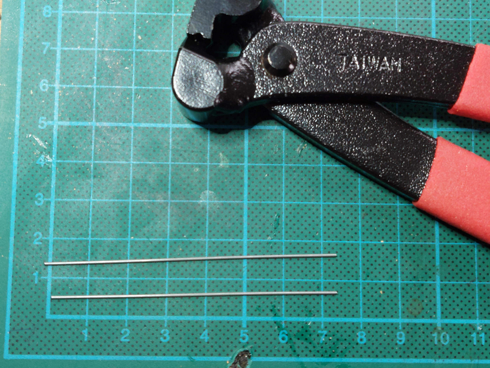

### Install the carbon

Put glue on the carbon rod and the corresponding place in the vtail. Wait 10 minutes and push the rod into the corresponding place.

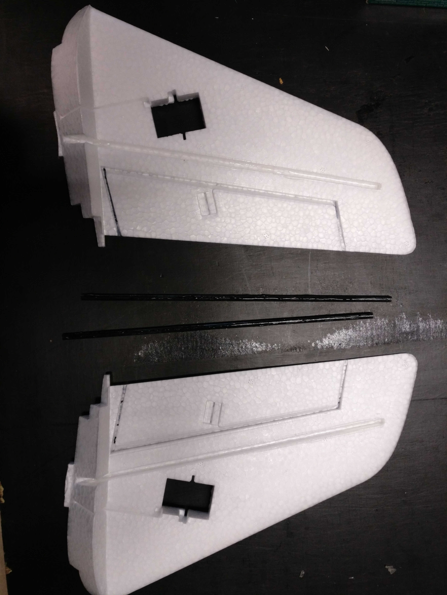

### Installing the rudder horn

Put glue on the lower part of the ruder horn. Put glue on the wing part.

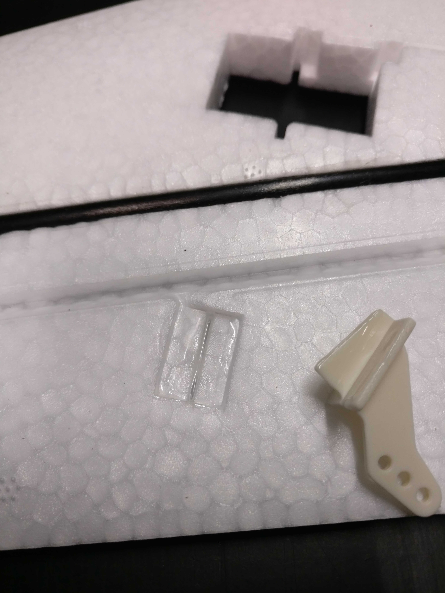

Insert the ruder horn into the wing and apply pressure:

Ruder horn after proper assembly:

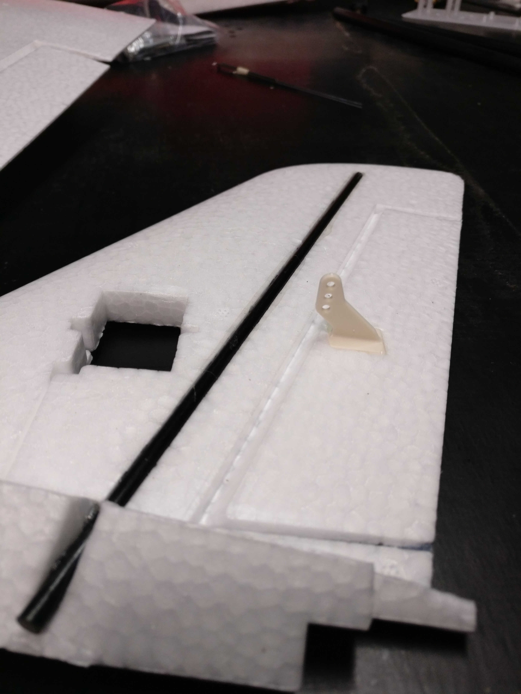

### Installing the servos into the wings

Make sure the servo is centered before installing the servo into the wing. Make sure the servo arm is installed with a O-Ring inbetween the servo arm and the servo housing.

#### Installing the servos in the main wings

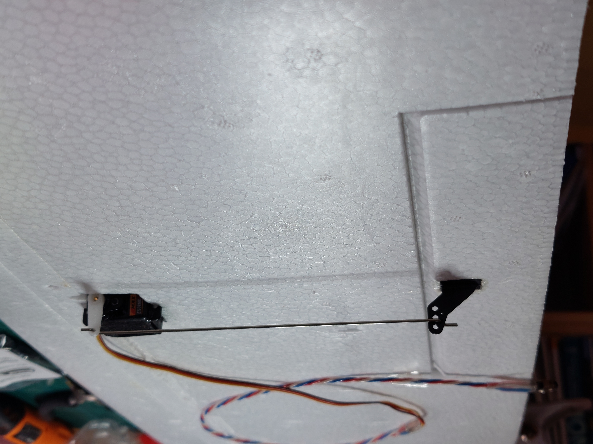

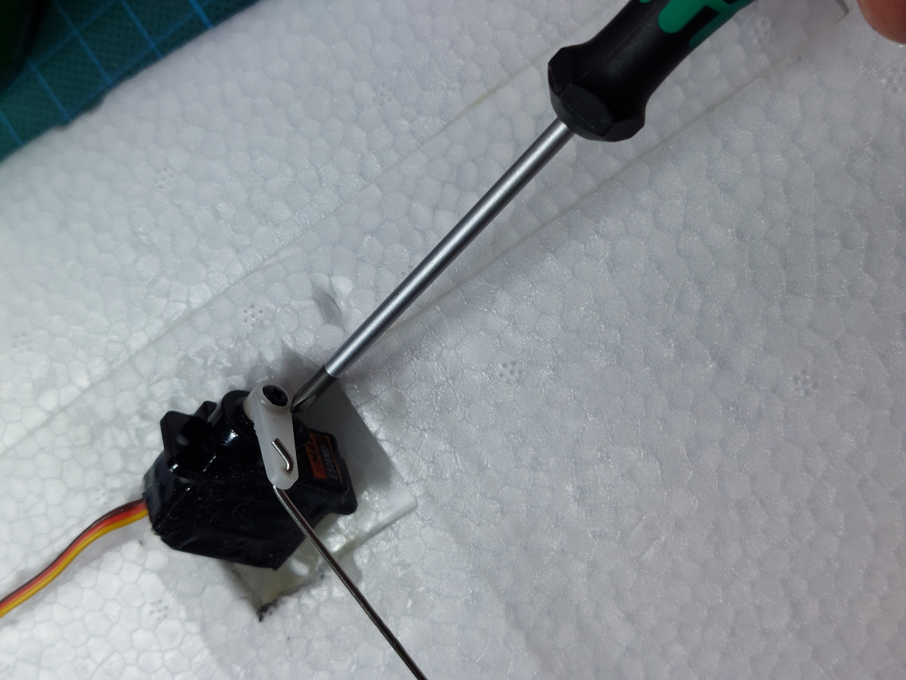

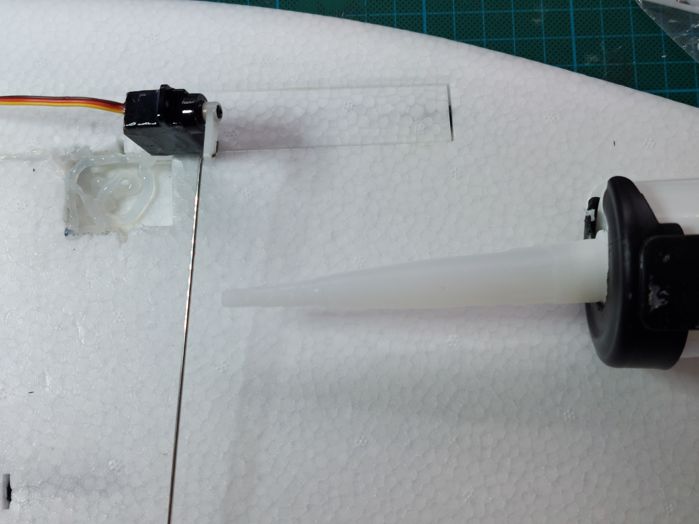

#### V-Tails

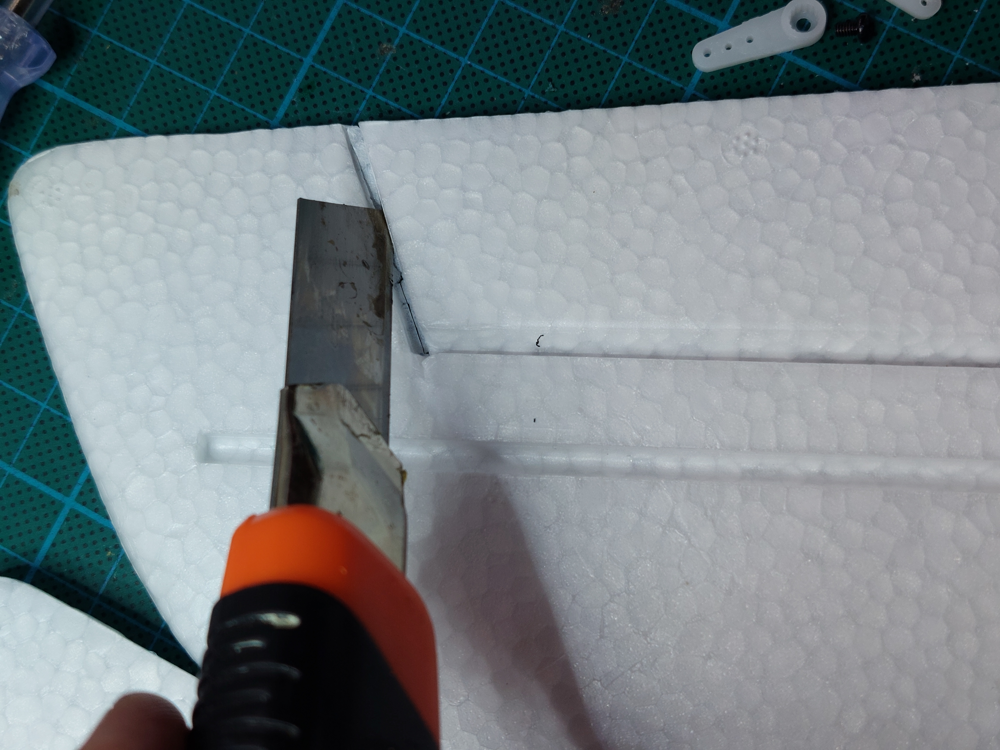

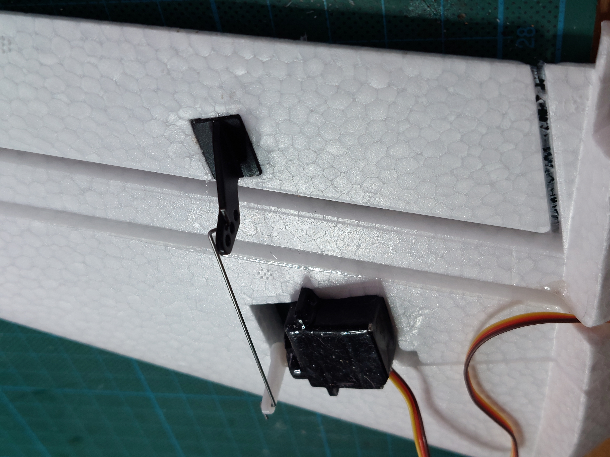

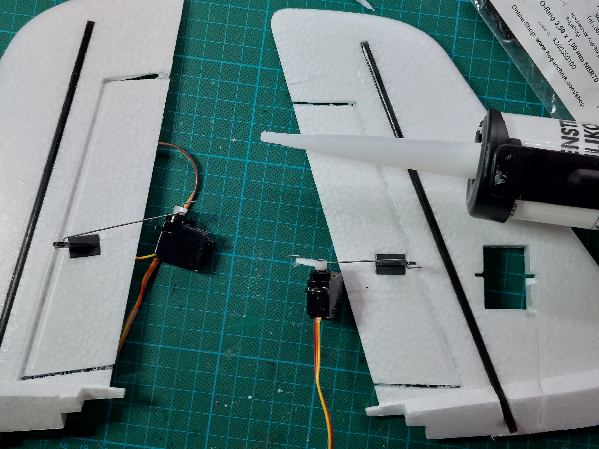

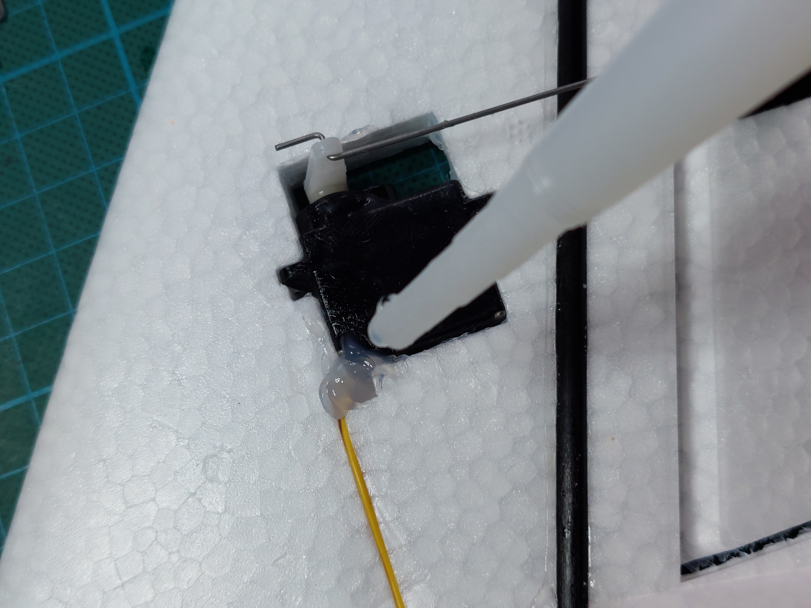

### Installing the wing rods

## Installing the servos into the V-Tails

### Installing the rudder horn

### Installing the servos into the wings

### Installing the servo pushrod

## Finalization & Testing

* [ ] check this
* [ ] and that...

