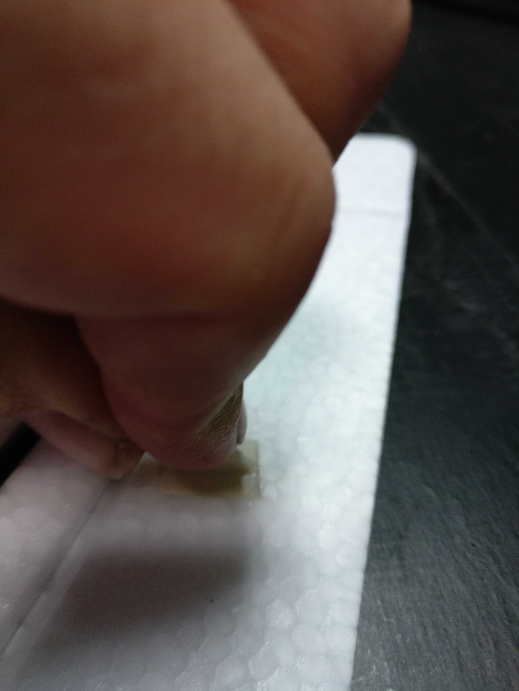

# Building V-Tails and Wings

#### Time required

* **Building:** 30 minutes

#### Tools required

* UHU Por glue
* spatula
* silicone

#### Parts required

* Extron Motor plus screws etc.
* 3D printed motor mount
* Servos with assembled servo arm
* servo push rods

## Preparing the wings

### Preparing and installing the servo pushrods

You can choose between two methods to mount the servo rods to the servo horns. If you don't want to drill a hole in the rudder horn, you can also use a flexible tube with and circumference of 2mm.



For the long two Pushrods cut off 150mm long wires, and 15mm long tube pieces and put the tube on one end like this:

Now bend the wires with the tube:

Now the other side like this:

**Repeat the process with two 75mm long wires**.







### Install the carbon

#### V-Tails

Put glue on the carbon rod and the corresponding place in the vtail. Wait 10 minutes and push the rod into the corresponding place.

#### Wings

Put the carbon wing pipe into the glue and remove it again so that the glue gets to the contact dry. Wait about 10 minutes.

When putting back the carbon parts apply high force to get a better stabillity. 

### Installing the rudder horn

Put glue on the lower part of the ruder horn. Put glue on the wing part.

Insert the ruder horn into the wing and apply pressure:

Ruder horn after proper assembly:

Now cut free the rudder of the V-Tail:

**Repeat the process with the Wings.**

### Installing the servos into the wings

Make sure the servo is centered before installing the servo into the wing. Make sure the servo arm is installed with a O-Ring inbetween the servo arm and the servo housing.

#### Installing the servos in the main wings

Before continuing with glueing the servos and cable into the wing make sure the carbon tubes are inserted into the wings.

**There is a right and wrong:**

**The short wire part after the angled part at the rudder horn is on the plane inside**

#### V-Tails

## Finalization & Testing

* [ ] check this
* [ ] and that...

