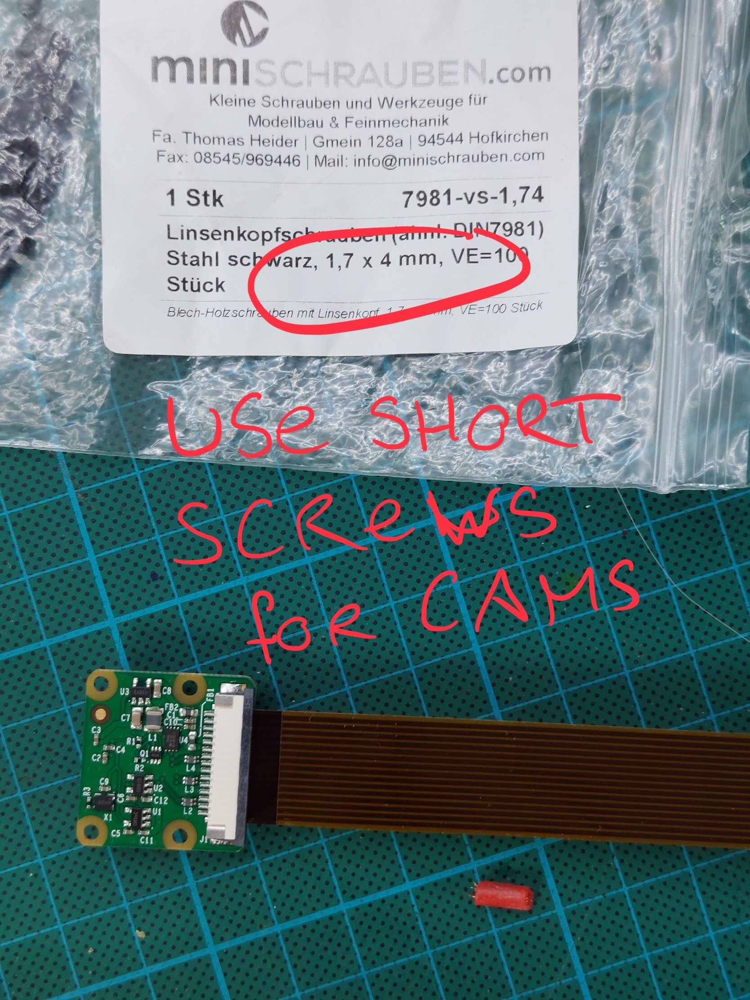
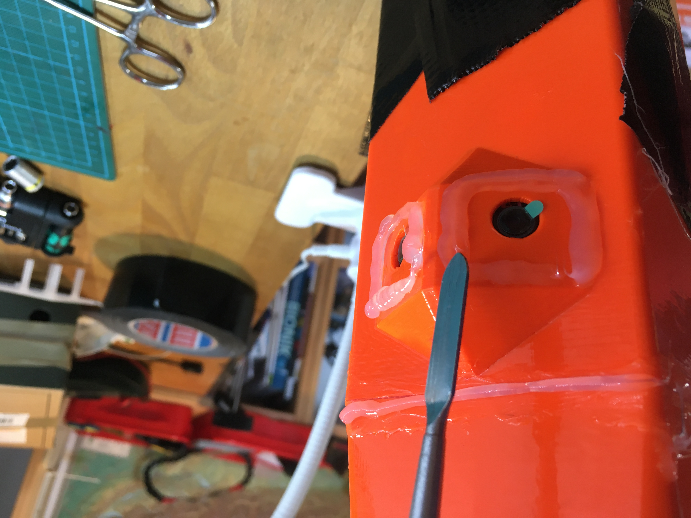
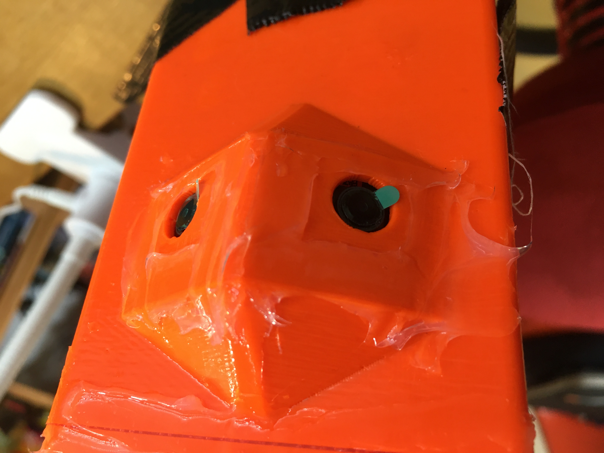
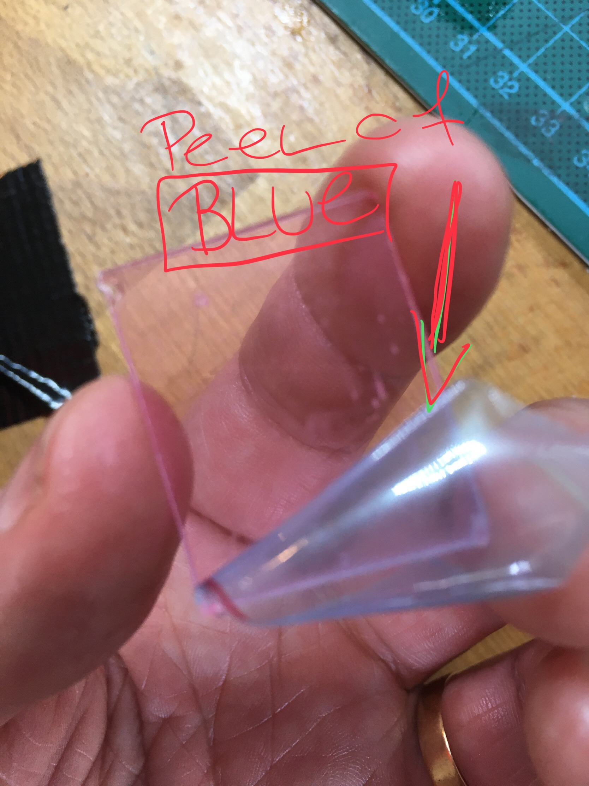
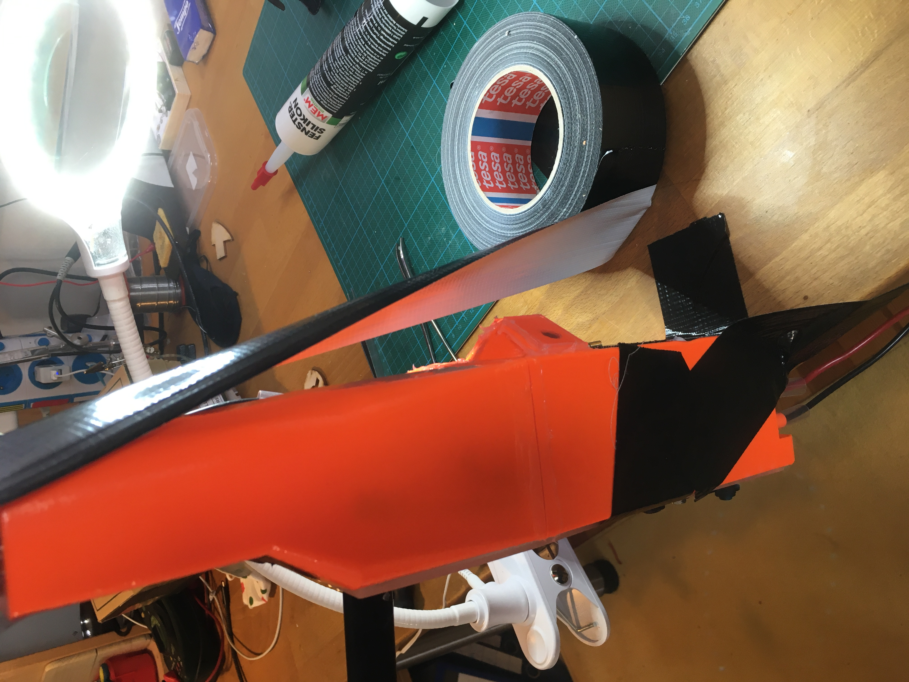
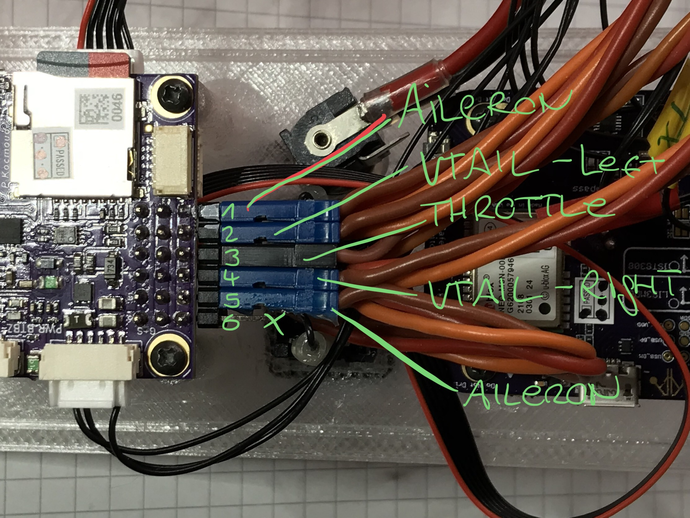

# Equipping the box with all components

#### Time required

* **Building:** 1 hour
* **Curing**: 2 days

#### Tools required

* Loctice 243
* 9mm wrench

#### Parts required

* all elecronic parts
* front and back of box
* cover for box
* screws 1.7mm x 4mm for camera
* ... 2.2mm x 6.5 for everything else
* Silicon 
* pen

## Step 1: Install the servo connectors


Give special instrucktion... 


## Step 2: Install Raspberry Pi and Camera

## Step 3: Install the Power Module

## Step 4: Prepare the cover

## Step 4: Combining front and back

## Connecting all the cables

#### Servo Cables

* Brown \(GND\) "up" \(away from cover\)
* Aileron left & right are "identical" - doesnt matter, which is connected to 1 / 5
* Connection 6 is left empty

## Finalization & Testing

* [ ] * [ ] and that...

