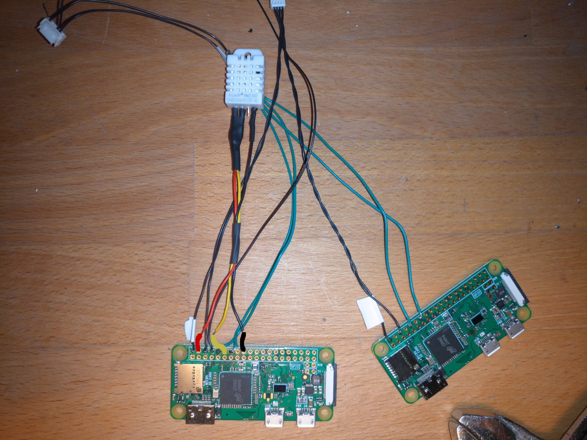
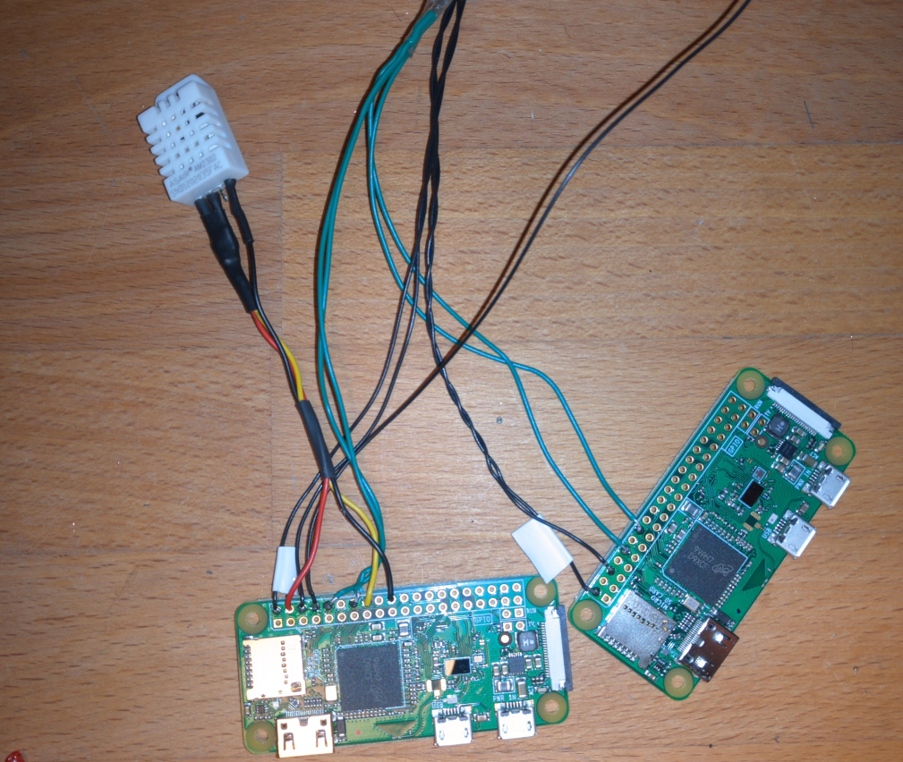
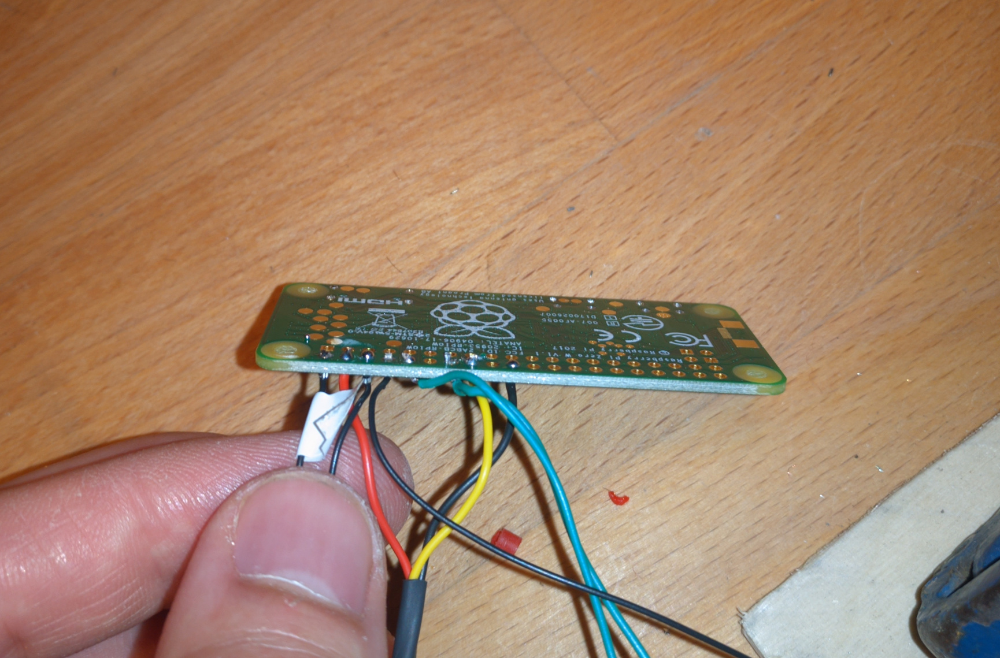

# Internal signal cables

#### Time required

* **Building:** 30 minutes

#### Tools required

* Soldering iron

#### Parts required

* Prepared pi zeros with cables
* Prepared DHT22

## DHT22 to pi zero

* Connect the DHT22 cables to the pi zero with the TX connector soldered as following...
  * Red - VCC --&gt; PI Zero Pin 4 or Pin 1
  * Yellow - Signal --&gt; Pi Zero Pin 16 
  * Black - GND --&gt; Pi Zero Pin 20 or 9

* Solder the cables
  * Put the cables through the corresponding open pins at the pi zero
  * Solder them

* Cut of the too long cables at the back of the pi to ~1mm

