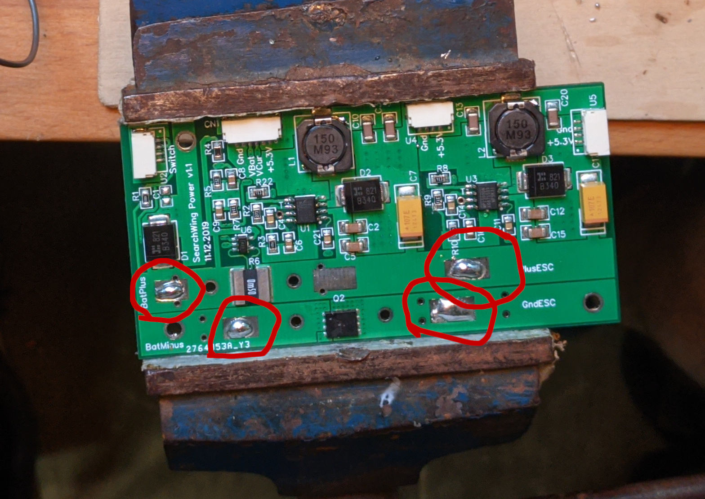
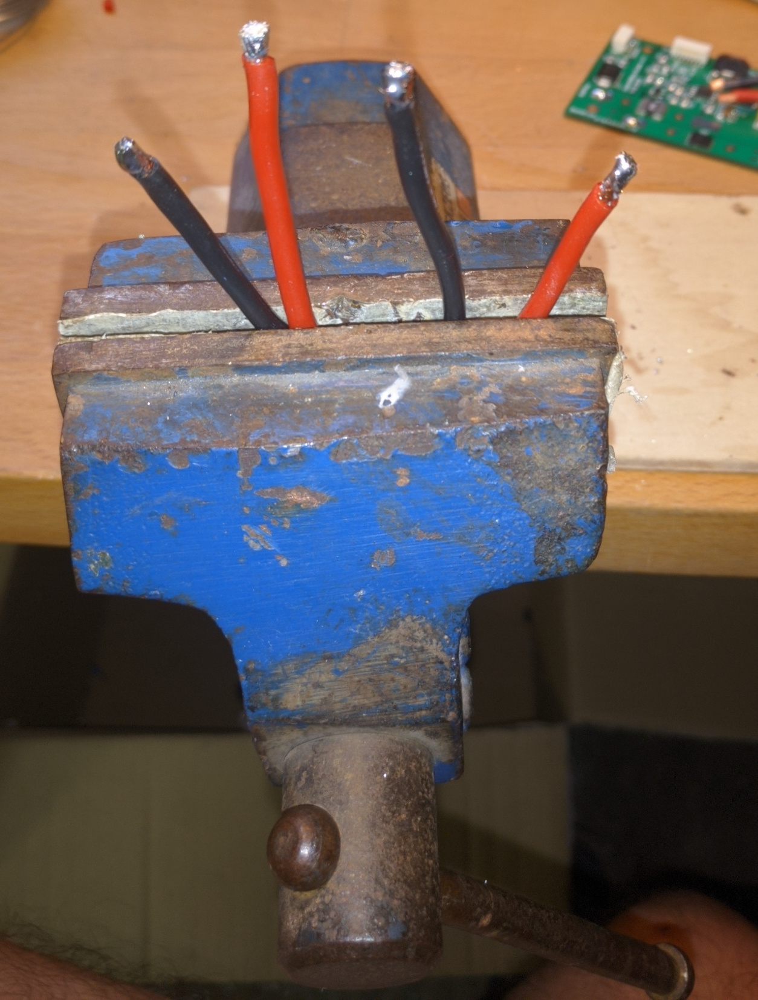
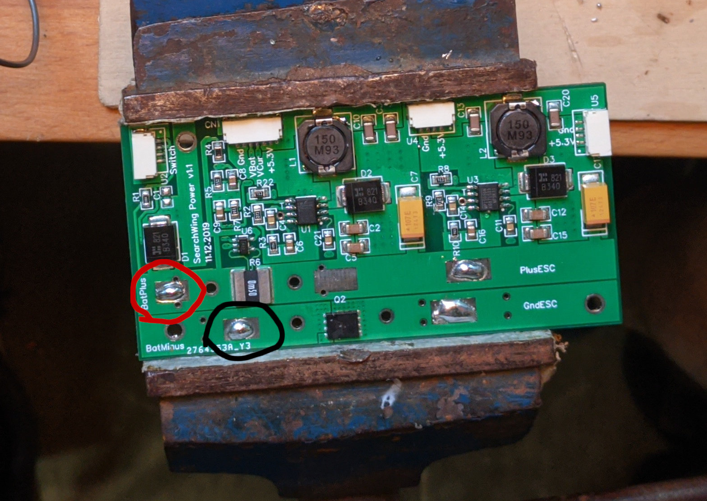
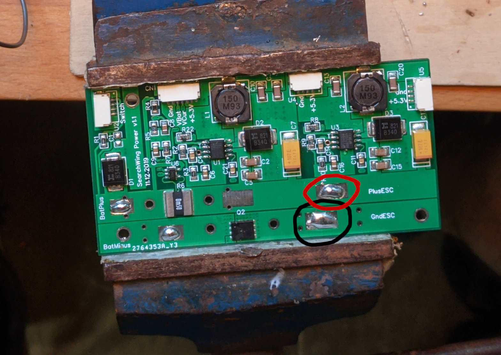
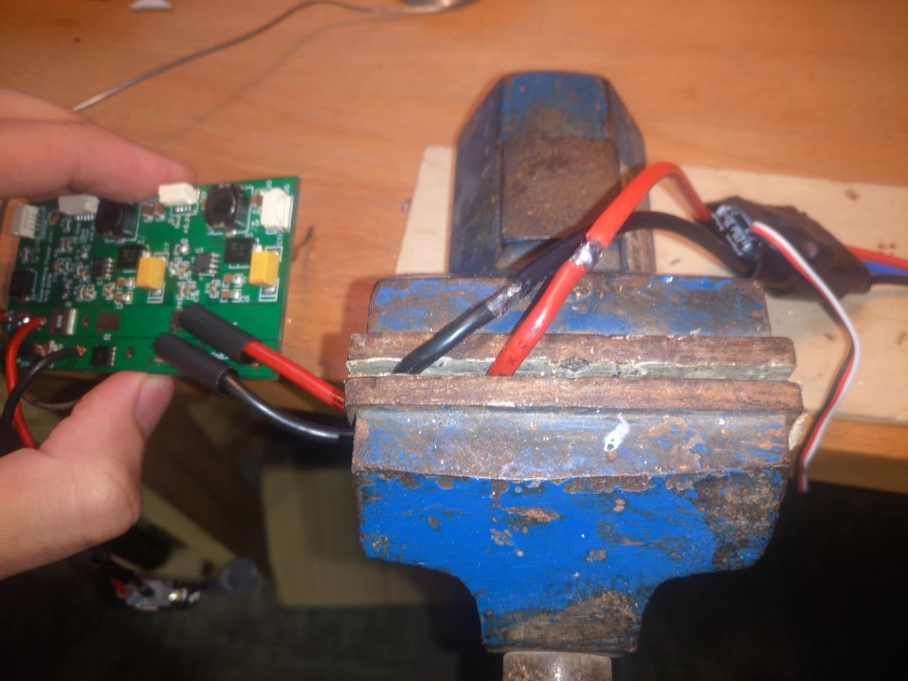
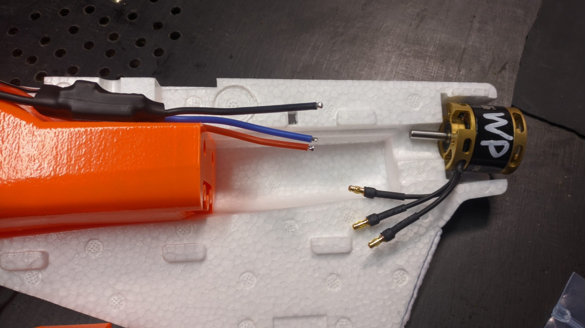
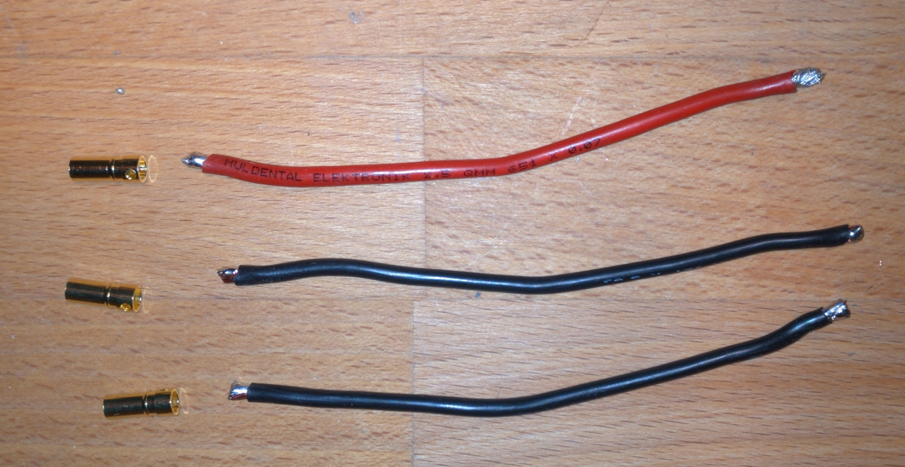
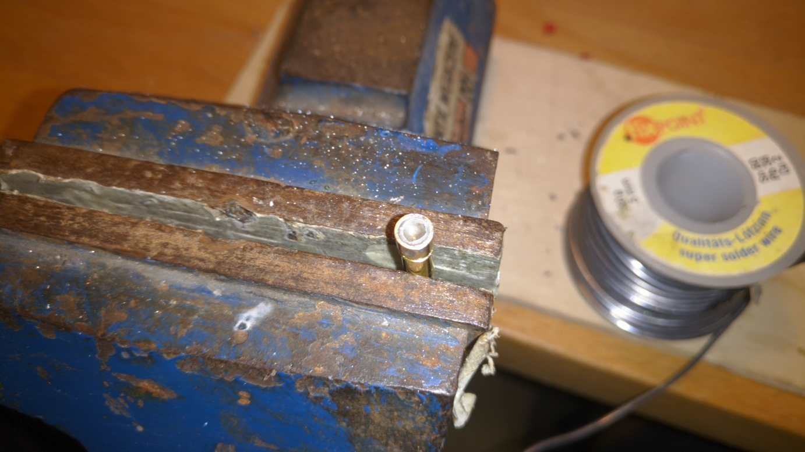
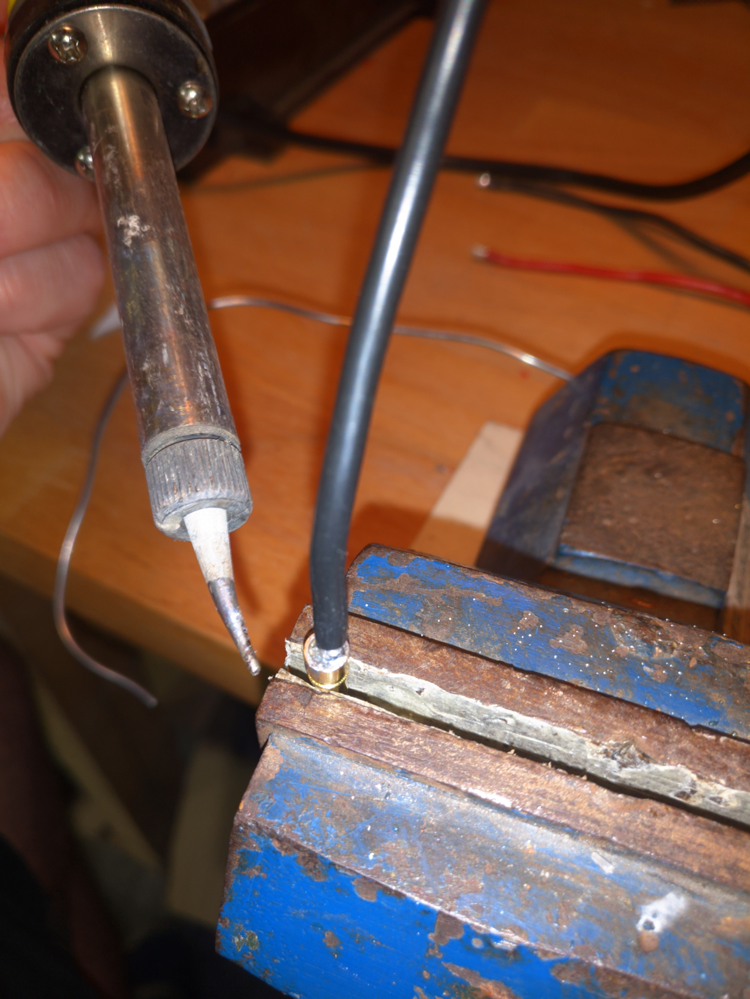
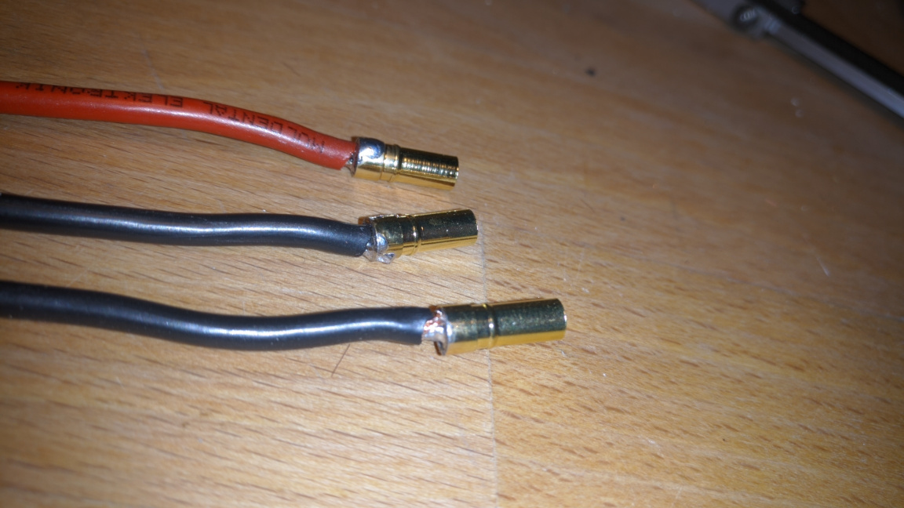

# Power cables

#### Time required

* **Building:** 30 minutes

#### Tools required

* Soldering iron
* Heatgun

#### Parts required

* Powermodule
* Powercable \(3mm diameter\)
* Shrink tubing
* ESC Pigtails for motor connection

## Prepare Power Module

* Presolder the following soldering pads for the upcoming steps

## Battery -&gt; Power Module

* Cut a 20cm piece of power cable \(red and black\) - long enough that the battery connctor outside can be connected
* Remove 3mm of isolation on both sides
* Presolder the wires

* Solder the Cables to the corresponding spots on the power module

## Power Module -&gt; ESC

* Cut a 13cm piece of power cable \(red and black\) - long enough that the power module can be connected to the esc at the very end of the back part of THEBOX™ 
* Remove 3mm of isolation on both sides
* Presolder the wires
* Solder the both wires to the corresponding spots on the powermodule

* Add two insolution tubes over the open ends of the cable
* Solder the two esc cables to the open ends of the cables from the step before

* Shrink the insulation tubes over the open soldering spots using the heatgun

## ESC -&gt; Motor

* Cut 3x 10cm pieces of power cable \(red + 2x black\) - long enough, that the motor and its pigtals could be later replaced without taking the fuselage apart

* Remove 3mm of isolation on both sides
* Presolder the wires on both sides

* Presolder the motor pigtails 
  * with enough solder that the whole pigtail is covered with a bit of solder
  * a lot of heat from the soldering iron is needed for this the heat up the whole pigtail

* Solder the presoldered pigtail with the presoldered cable

## Shrinking the cables to the box

* TODO how to make waterproof
  * battery cables
  * ESC cables
    * to the box
    * to the motorconnectors
    * Which cables to put together to make the motor rotatet the correct direction?

## Finalization & Testing

* [ ] check this
* [ ] and that...
* [ ] 
