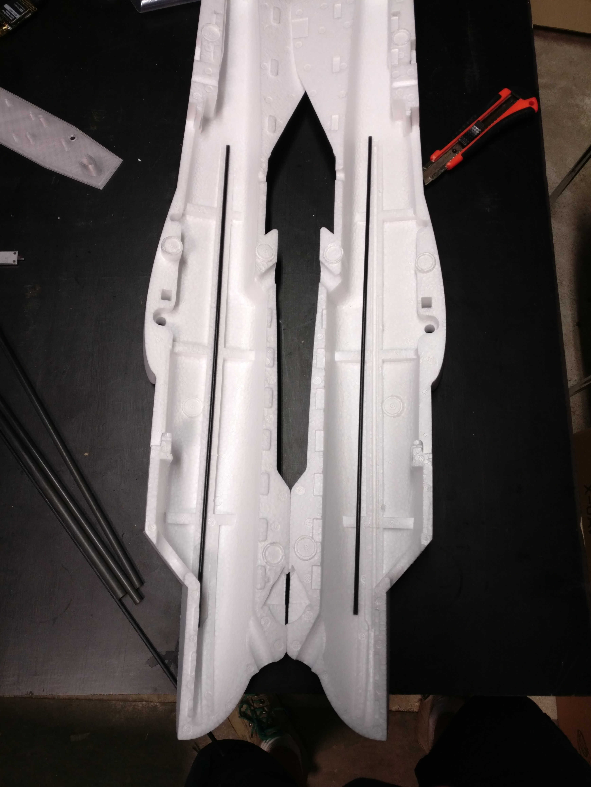
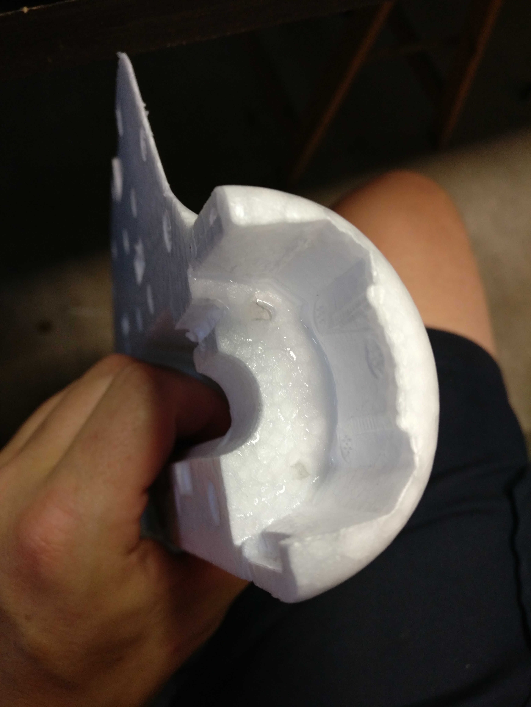
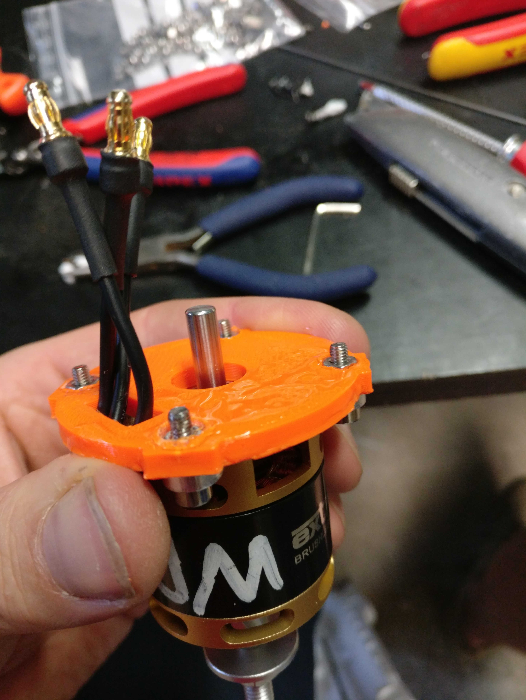
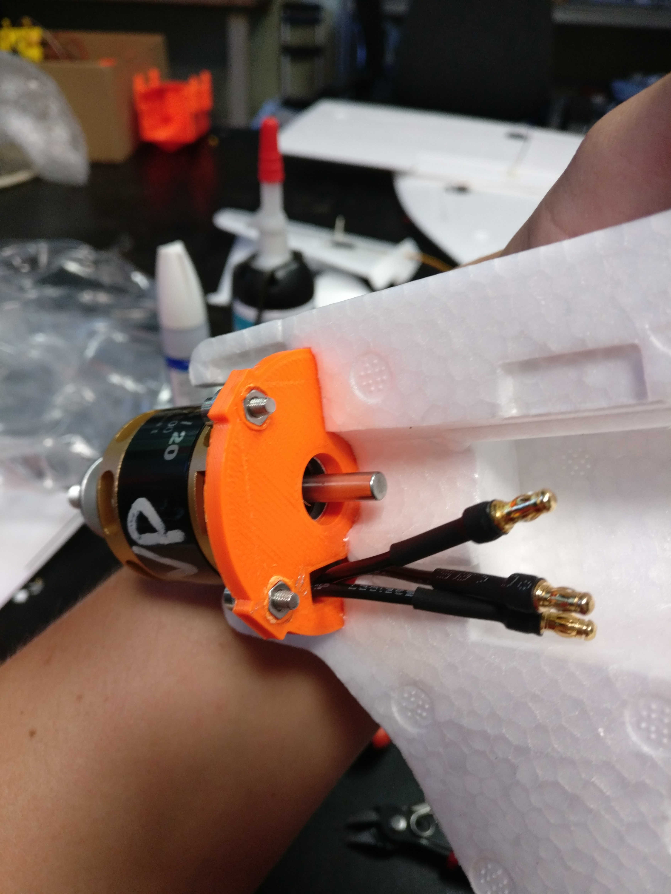

# Preparing the fuselage

#### Time required

* **Building:** 30 minutes

#### Tools required

* UHU Por glue
* spatula
* cutter/knife

#### Parts required

* carbon rods
* both fuselage parts
* 3D printed motor mount

## Installing carbon fuselage rods

Apply UHU por glue to the carbon rods and the fuselage part where the rods are inserted. Wait 10 mintues. Press the rods into the slots in the fuselage.

## Installing the V-Tails to the fuselage

## Installing the motor mount

Apply UHU Por glue to the first half of the fuselage:

Apply glue to half of the motor mount:

Wait for 10 minutes and press motor mount firmly against the fuselage.

## Cutting the opening for the cameras

## Finalization & Testing

* [ ] check this
* [ ] and that...

