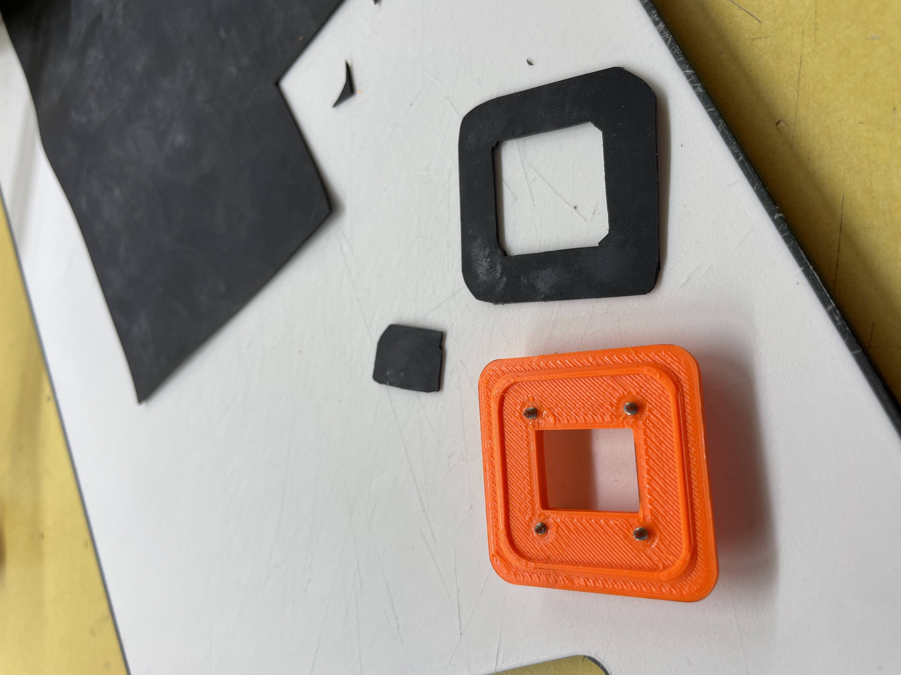

# Preparing the water tight battery bag

#### Time required

* **Building:** 30 minutes

#### Tools required

* solder iron
* screwdriver
* knife to cut the rubber seal
* shrink tube
* aloksak sealable bag
* Curil K2

#### Parts required

* 3D-Printed cable passage \([Printing and preparing the box](../generic-componets/printing-and-preparing-the-box.md)\)
* Rubber seal
* XT-90 Battery connector \(female\)

## Assembly Instructions


Make sure your working area is clear of sharp parts! These can easily harm the bag!


1. Use shrink tube to attach the cables to the outer part
2. Cut the rubber according to picture
3. Put a cutting board inside the bag
4. mark the size of the inner part
5. cut a hole into the bag
6. put Curil on the outer part & one side of the rubber - let it dry for 5 minutes
7. Turn the bag inside out
8. screw the parts together
9. solder the XT90


The rubber should be cut large enough, so the screws don't go through it. this makes assembly much easier


## Finalization & Testing

1. Put air in the bag
2. seal it according to the instructions on the bag
3. hold it under water
4. No air or bubbles shoud be visible

