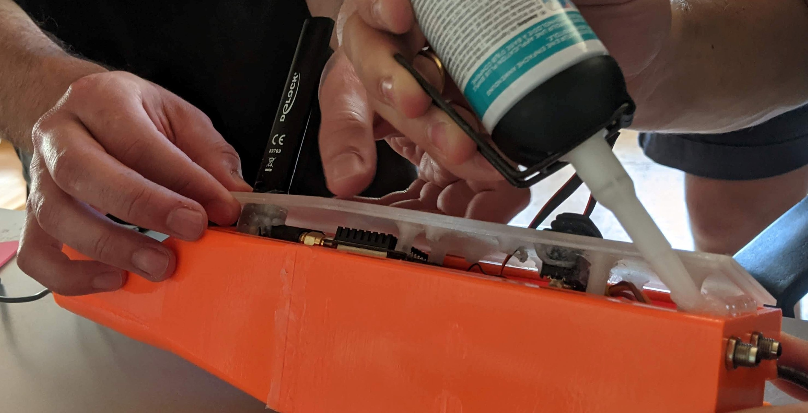

# Closing the box

#### Time required

* **Building:** 30 minutes
* **Curing**: 2 days

#### Tools required

* Silicone 
* Silicone press
* Tape

#### Parts required

* Cover
* glued box

## Step 1: Apply silicone

Apply the silicone as shown in the picture. The string should be on the groove with a diameter of about 7mm as shown in the pictures.

## Step 2: Pressing on the cover

After applying the silicone on the box you need to press on the cover. The silicone should come out on each side of the box. 

Now you should get some tape and try to fix the cover to hold it down a little bit as shown in the picture.

## Step 3: Sticking the GPS tower

For better GPS connention there is a 3D-printed tower for the GPS module. This one needs to be "glued" to the box with the silicone as well. For more details see pictures. 

The tower needs to be attached with tape as well. 

## Finalization & Testing

For testing the waterproofness put the box into the bathroom and shower it. Don't forget to attach the membrane on the holes! While testing the waterproofness you should be connected to the Pi's to see the values of the DHT22 sensor. 

* [ ] check this
* [ ] and that...

