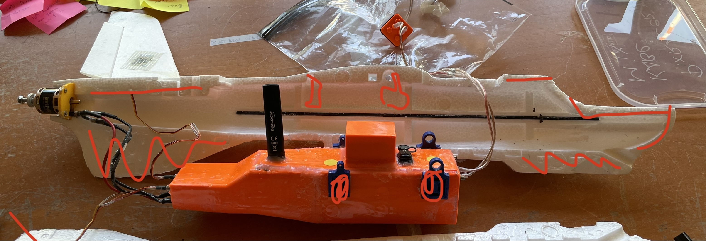

# "Marriage" - combining box & fuselage

#### Time required

* 30 Minutes work
* 1 day to cure the motor mount glue

#### Tools required

* UHU Por

#### Parts required

* assemblied Fuselage halfs

**Check for Defects before continuation**

* are V-Tails glued in?
* are the carbon pipes for Fuselage stabilisation glued in?
* is the motor glued in \(in one side\)?
* are the Servo-Connectors tightly screwed on?
* are all 3 motor connectors correctly attached \(rotation direction of the motor\)
* are all 3 moter connectors secured with watertight shrink tube?
* are all connectiots \(V-Tail Servos, Motor plugs...\) connected and secured? 

## Building Instructions

1. Prepare all parts
2. Apply UHU Por on both parts of the fusselage
3. Spread equally and let it dry for 10 minutes until nearly dry
4. Only now put UHU on the motor mount \(Yellow below\) - it should NOT dry
5. Put the 2 parts together - 


 UHU Por is a "contact glue" - you can not move them after pressing them together



Why use wet glue on the motor mount? 

The motor mount is inserted sidewards into the fusselage - if the glue is dry, its hard to get it in properly. UHU Por can also be used as a "wet" glue.


## Finalization & Testing

* [ ] Check if both parts stick together
* [ ] Check the V-Tails are fixed
* [ ] 
