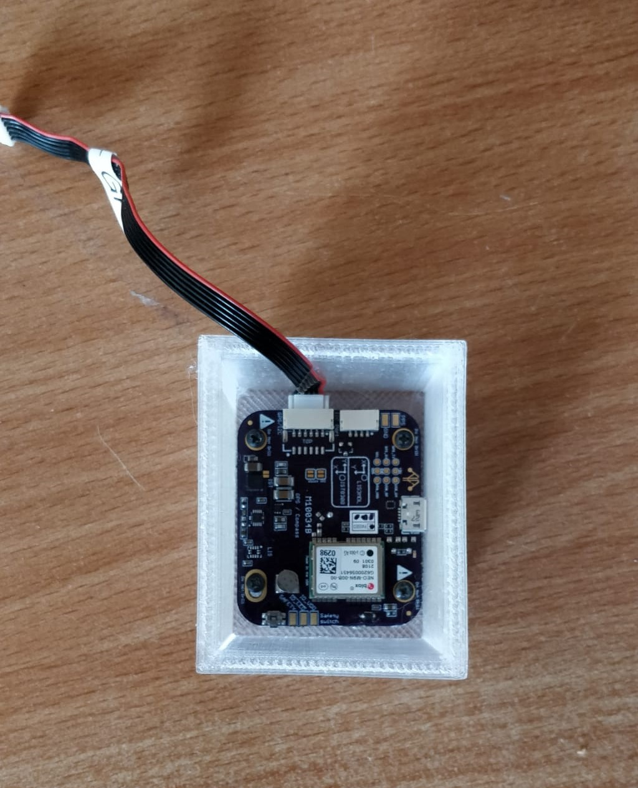
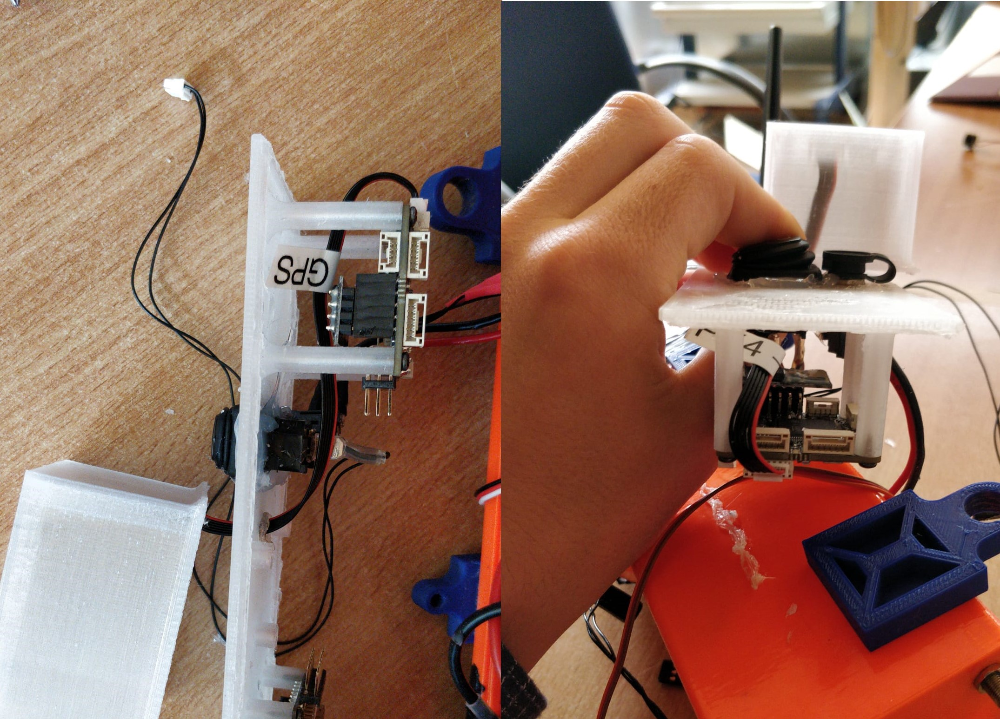
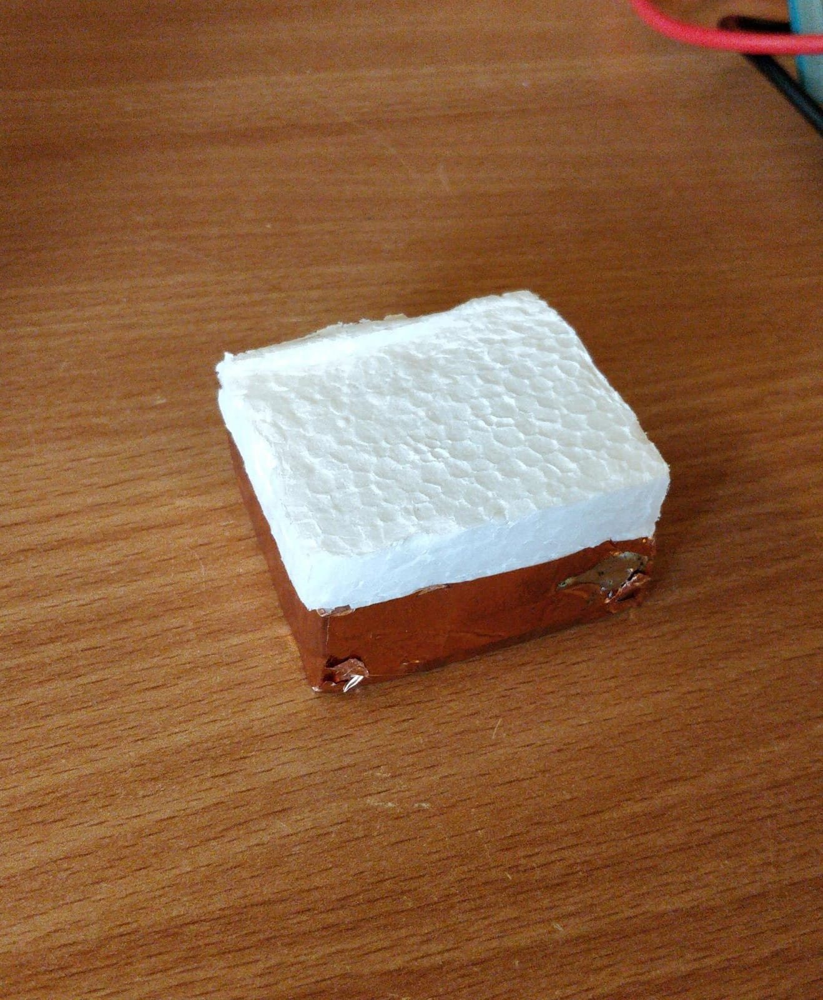
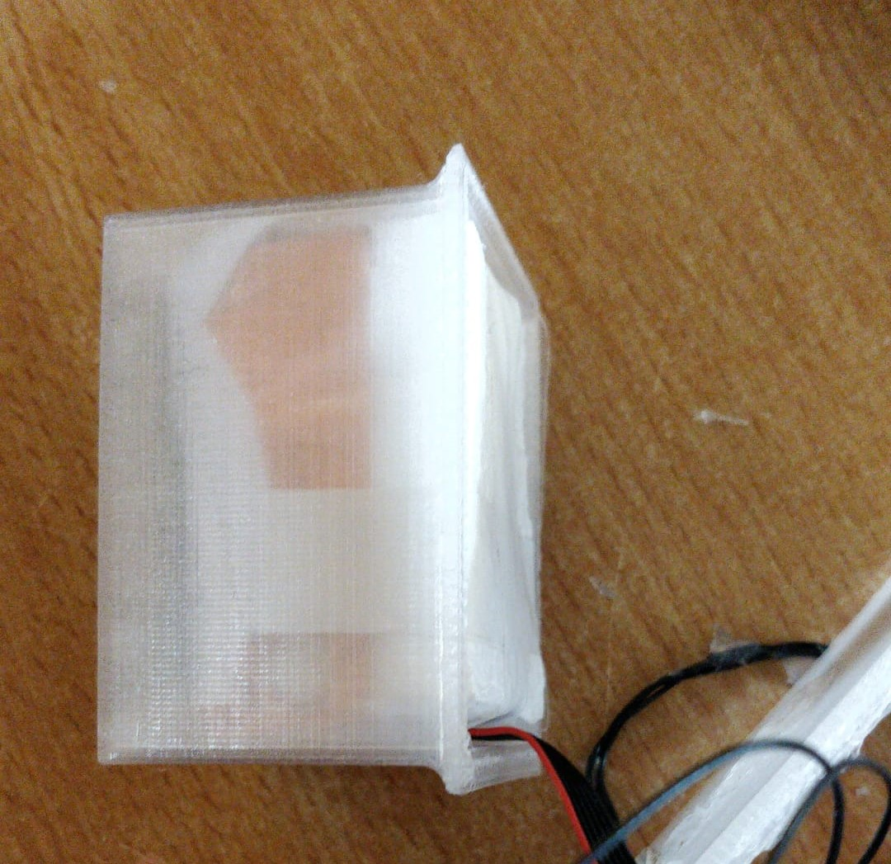

# GPS Tower

Screw in the GPS m9n Module. Direction doesn't matter. Case is symmetrical.

Fit GPS cable through the hole in the cover and plug it in the designated port on the pixracer.

#### Electromagnetic shielding

Prepare a styropor cube of the size: 50x40x30mm and cover the bottom side with Alu or Copper foil. 

To prevent short circuits wrap it with some plastic foil. 

Here are some leftovers from the vacuum packages from the battery bag used.

Put the cube in the GPS tower.

#### GPS Test

Before glueing of the Tower check if the GPS gets an appropriate amount of Sattelite locks \(&gt;15 is good\).

