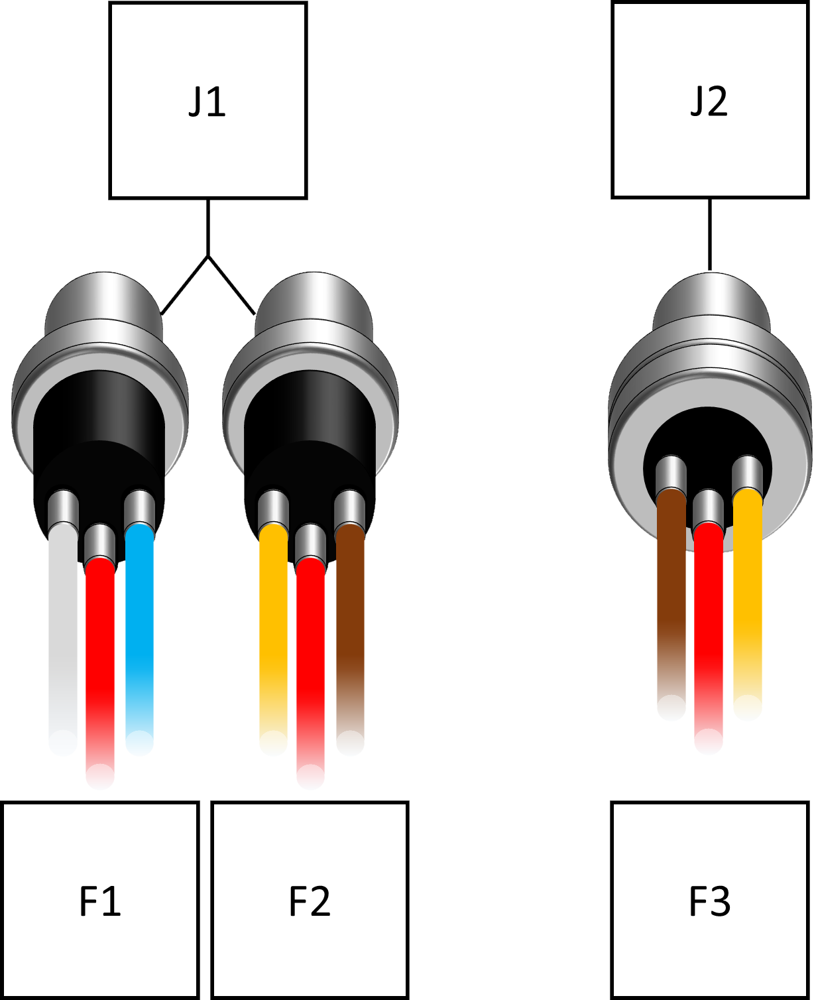
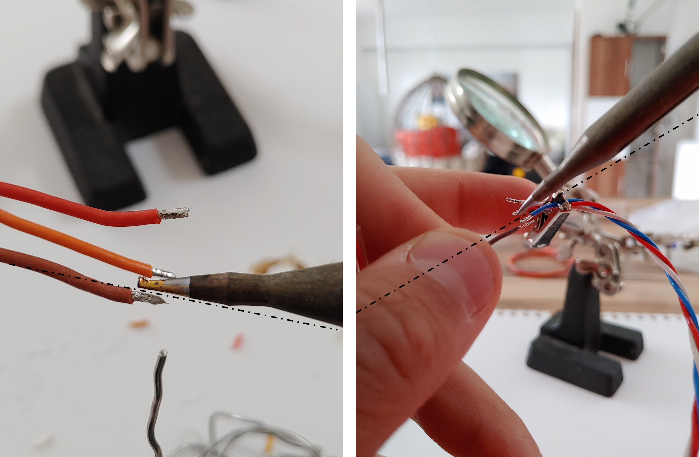
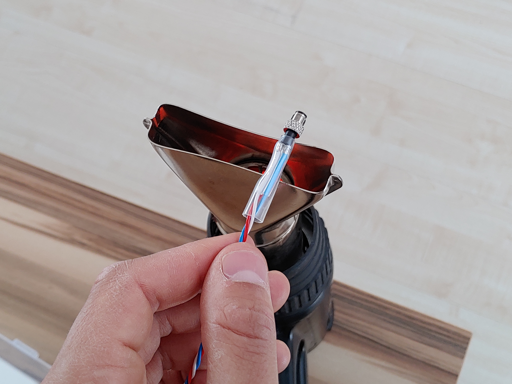
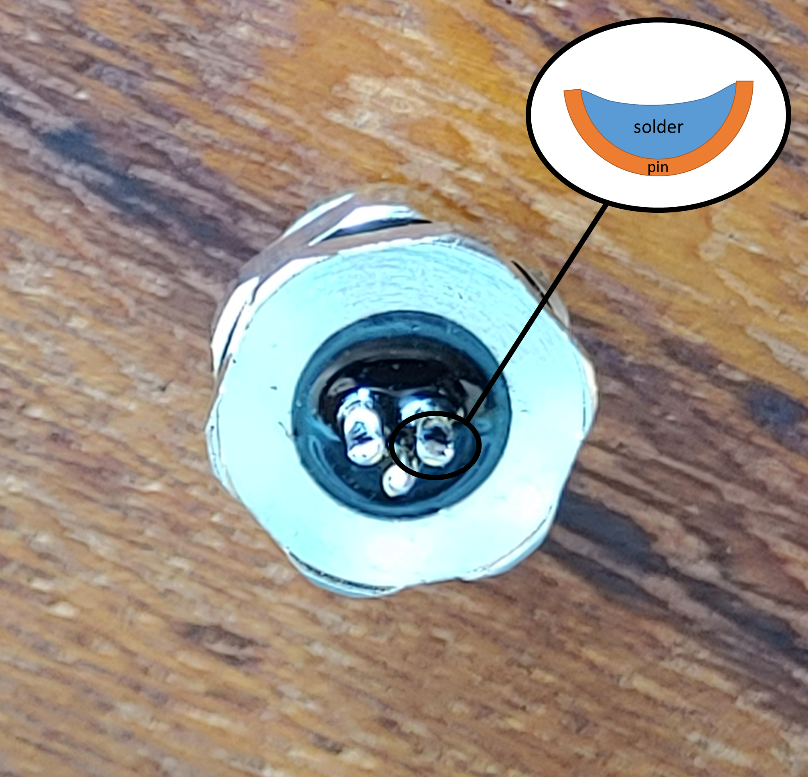
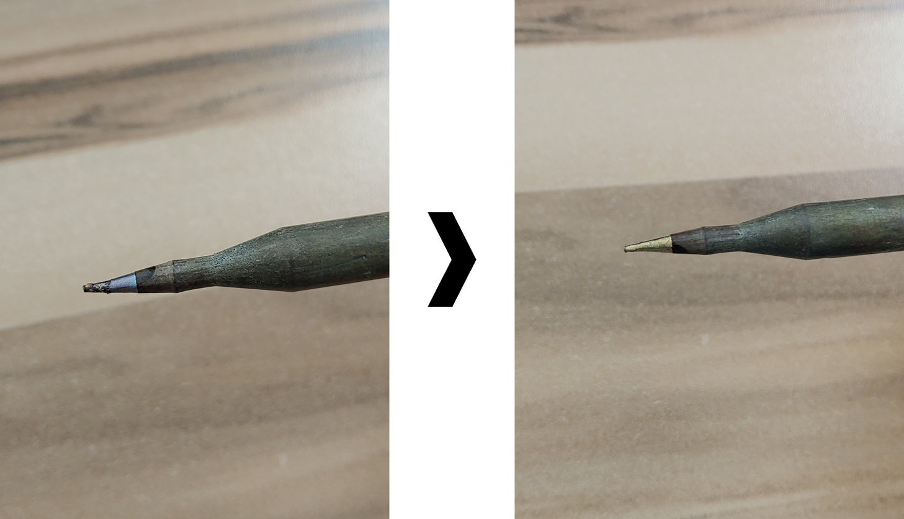

# M5-Servo-Plugs

## Final Product

* 2x F1
* 2x F2
* 4x F3

## Requirements 

### Time required

* **Complete cable assebly set:** **170 min**
  * Preparation: 30 min
  * Building F1: 60 min
  * Building F2: 40 min
  * Building F3: 40 min

### Tools required

### Parts required

* [Prepared Servos](untitled-1.md) 
* 4x 
* 4x 

### Preparation

Schrumpfschlauch und Kabel ablängen 

## Step by Step Guide

#### 

#### 

### F1

### F2

### F3

### 

## P**in assignment**

## **Tips and Tricks**

## Finalization & Testing

* [ ] check this
* [ ] and that...

#### Outdated Manual: 



