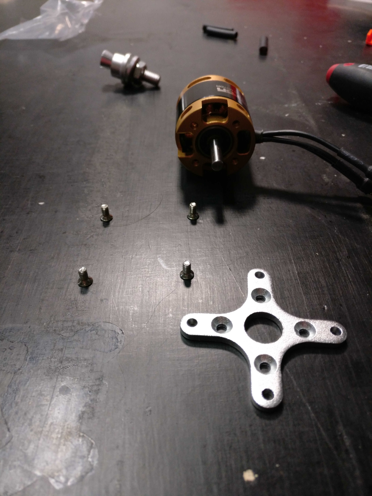
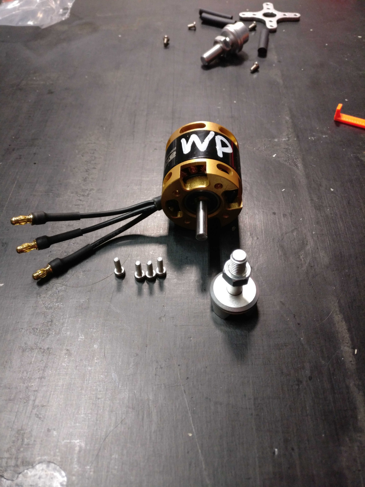
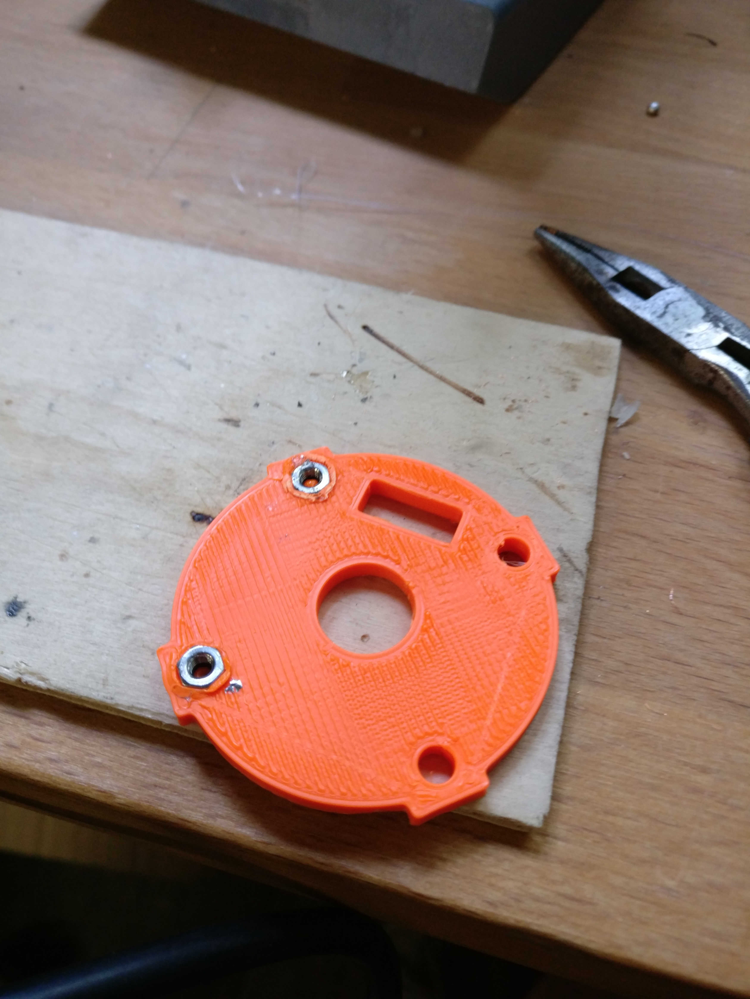

# Motor assembly and motor mount preparation

### Motorkreuz und Propelleraxe

* Motorkreuz an Motor schrauben \(M3x6mm, PH1, metrisch mit Senkkopf\)

* Propelleraxe an Motor schrauben

### Motormount

* Einpressmuttern in die Motorhalterung einpressen \(Muttern warm machen, z.B. mit dem Lötkolben und mit Zange einpressen\)

* Motorkreuz an Motormount schrauben \(M3x10mm, PZ1, nicht metrisch\)

