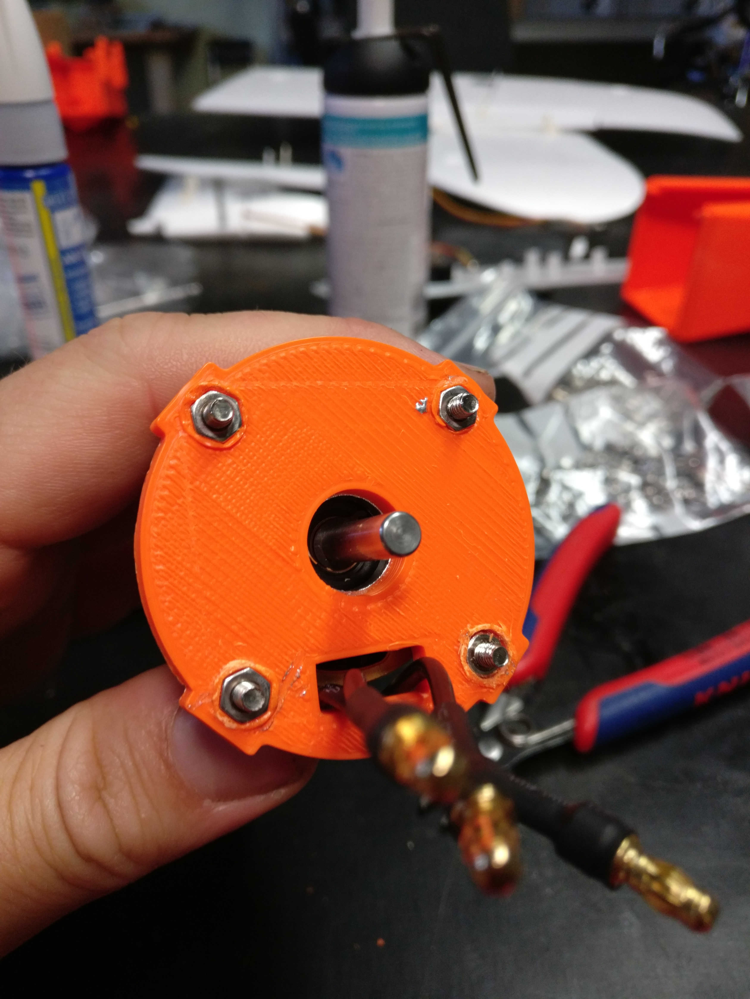

# Motor assembly and motor mount preparation

### Required

* Motor marked with "WP" \(waterproof\)
* 4 screws M3x6mm
* 4 screws cylindric head
* 4 non-metric? screw for motor mount
* 4 screw nuts
* motor cross
* 3D-printed motor mount
* **Loctite for all screws!**

### Motor cross and propeller axis

* Screw motor cross to motor \(M3x6mm, PH1, metric with countersunk head\)

* screw propeller axis to motor

### Motor mount

* Press nuts in motor mount \(heat nuts and use tool\)

* screw motor cross to motor mount \(M3x10mm, PZ1, not metric?\)

