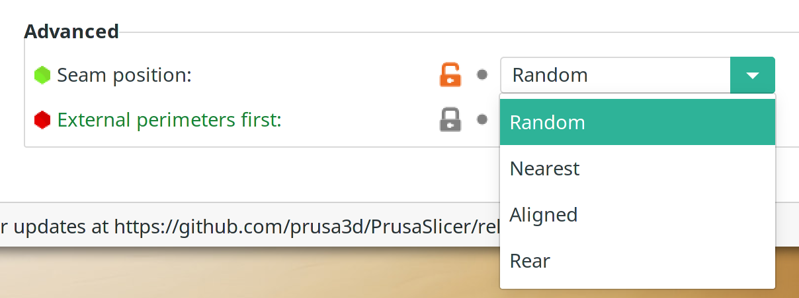
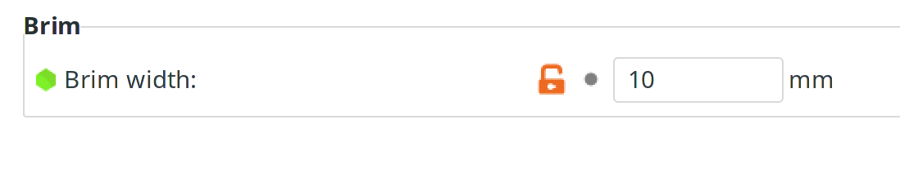
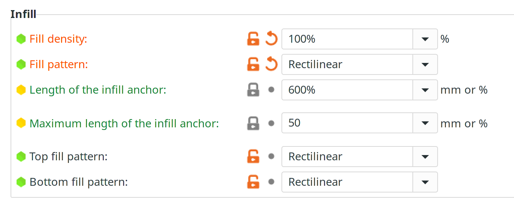
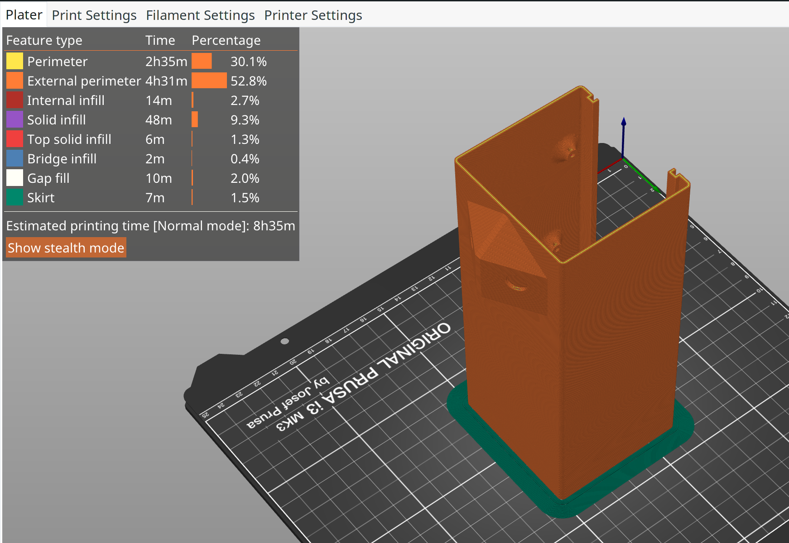
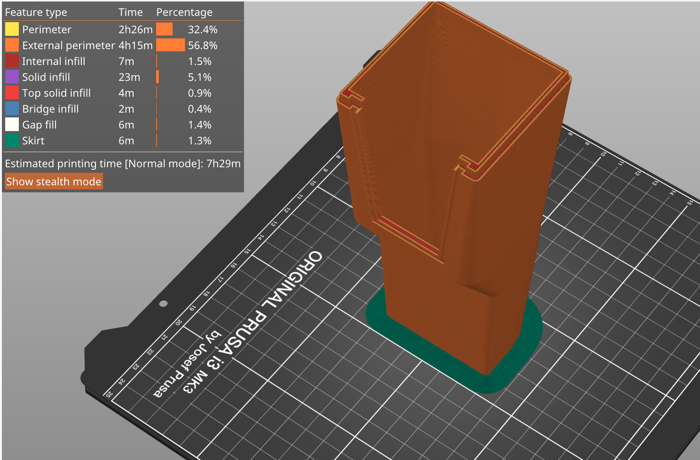
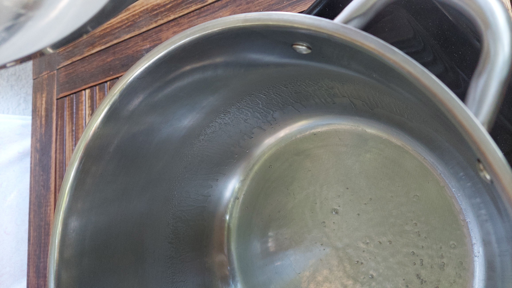
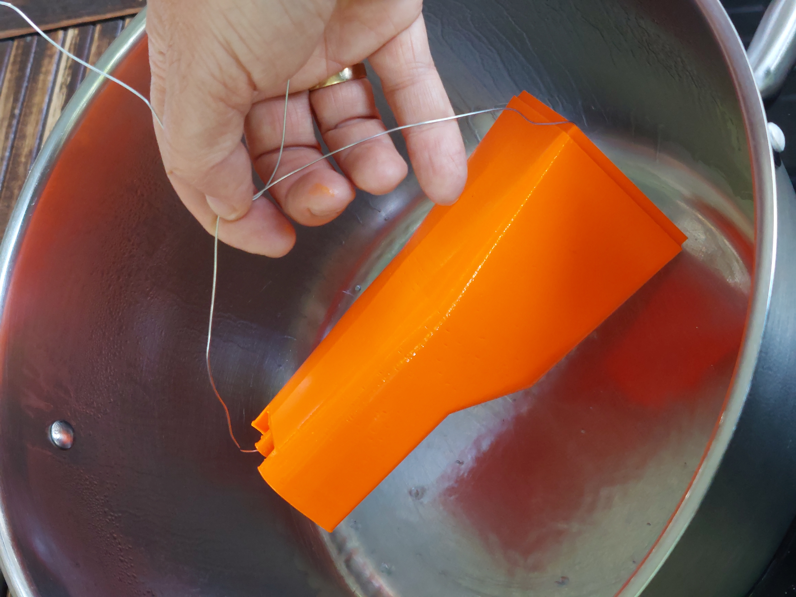
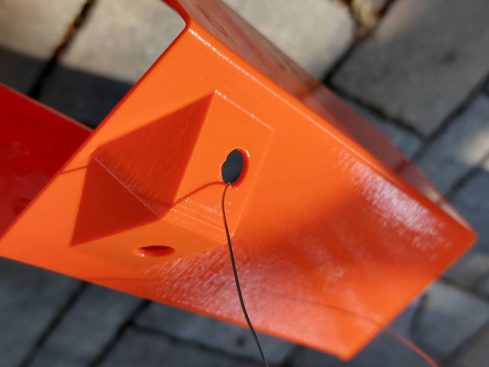

# Printing and preparing the box

#### Time required

* **Preparation:** 30 Minutes
* **Print Time:** approx. 15 hours 
* **Curing time after Aceton:** 1 day 

#### Tools required

* 3D-Printer \(Prusa recommendet\)

#### Parts required

* ASA Filament
* Acetone 

## The right printing material

We choose ASA \([DuraPro ASA](https://www.extrudr.com/de/produkte/catalogue/asa-durapro-neon-orange_2989/)\) as our printing material of choice:

* **Light** \(approx. 30% lighter than PETG\)
* **Stable** - good layer adhesion \(compared to ABS\)
* Can be smoothed with **Aceton**

## Settings for the slicing / printing


The complete config bundle for the PrusaSlicer, most current STL Files ande more can be downloaded here:




Seams are very important, when printing watertight elements: by default, most slicers set the seams next to each other, because this looks better. But this leads also to an easy way for water to penetrate all the perimeters. Set to "Random".

The brim is important, when printing with ASA. ASA tends to warp and contract - this holds the print better to the plate.

Density is set to 100% - the box is designed, to print in 4+ perimeters, this makes sure, all the cavities are filled. 

## Printing the parts

### Box - Front

### Box - Back

### Wing-Connectors

### Box - Cover

## Acetone-vapor the box

#### Preparation

* Acetone - 100 ml
* Big, acetone proof container 
* container for filling boiling water
* attach the to be smoothed parts to wires


**Acetone is toxic!** Wear appropriate protection gear, especially a respiratory protection and gloves!

Do the whole procedure **OUTSIDE with good ventilation!**

**Acetone vapors are explosive!**


* Boil 1l of water
* fill the acetone into the big container
* fill the boiling water into the bottom container


You can see the level of the vaporized acetone on the side of the container as drops


#### Smoothing the ASA Parts

* lower the parts into the acetone vapor
* wait 20-30 seconds
* you see the surface getting "shiny"
* finished!

#### Curing / Drying

## Glue the holders to the box 

## Glue camera glasses to the box

## Finalization & Testing

* [ ] check this
* [ ] and that...

