# Producing special cables

#### Time required

* **Building:** 30 minutes

#### Tools required

* soldering iron
* heat shrink tube

#### Parts required

for DHT:

* 3x Cable ca. 65mm \(red, yellow, black\)
* 1x Cable ca. 30mm 
* 1x 4.7 kOhm \(yellow\)

## Power-Module -&gt; Raspberry Pi Zero & DHT22

This cable connects the power from the power module to the 2 Raspberry Pi Zeros. This cable also connects the DHT22 sensor \(humidity and temperature\) to one pi.

#### DHT22 -&gt; Raspberry Pi Zero

To meassure the air temperature and humidity on the inside of the Box, a DHT22 sensor needs to be attached to one of the Pi's. 

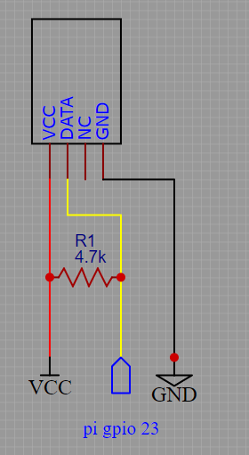

1. First solder \(red\) vcc cable and the resistor to the DHT as shown

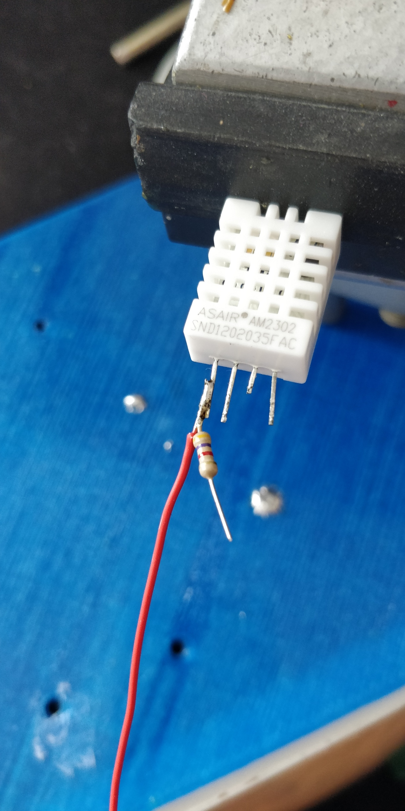

2. Solder the 20mm cable to the data Pin and shrink the first DHT pin.

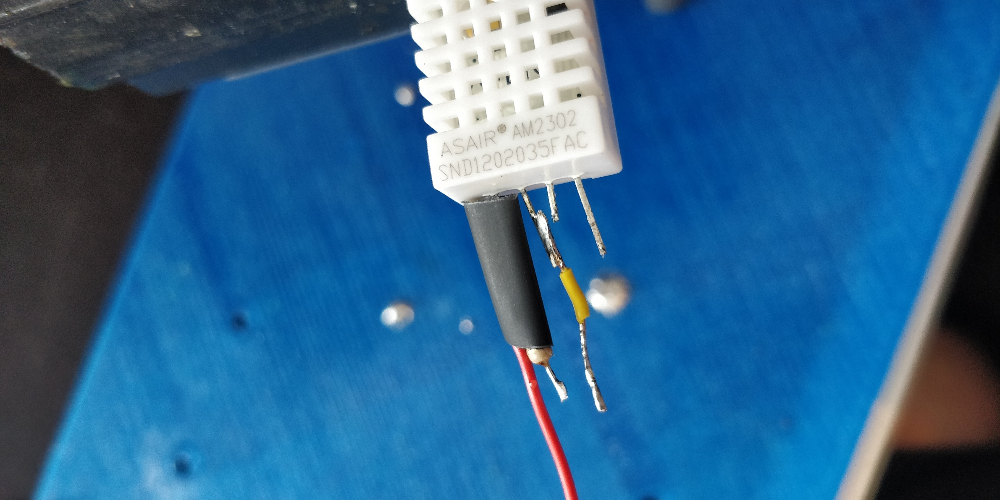

3. Solder the open end of the resistor, the open end of the 20mm cable and the long data cable \(yellow\) together.

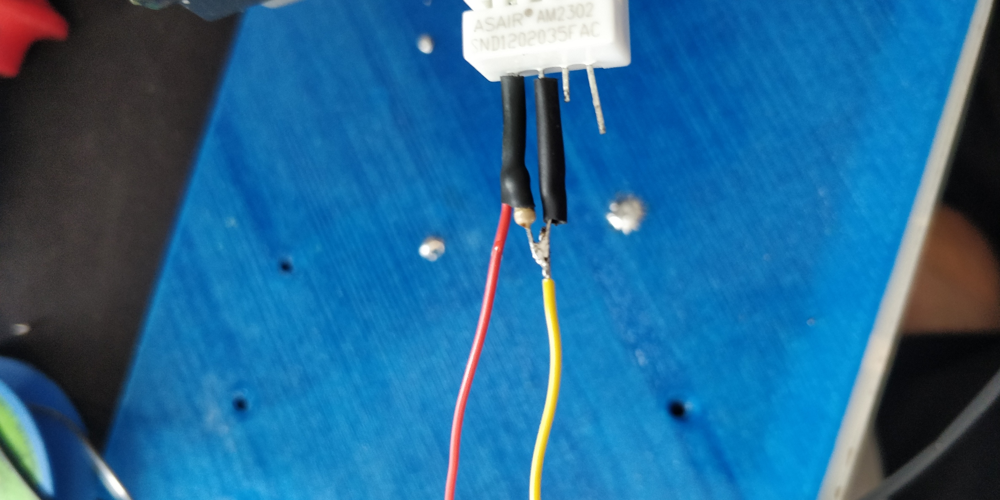

4. Attach the \(black\) GND cable to the last Pin, and cover your bad soldering points with shrinking tube.

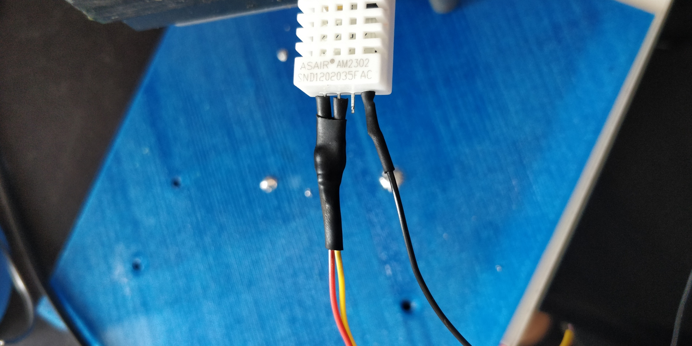

## Power Switch -&gt; Power Module

* Solder two precrimped JST-GH cables \(~20cm long\) to the power switch as follows

* Isolate the cables at the switch side
  * Using hot glue
  * !! Special caution needed on the lenght of the isolation at the switch side !!

## PixRacer -&gt; Raspberry Pi -&gt; PowerModule

This cable connects the PixRacer and the two Pi's. Furthermore there is a power supply cable for the Pi's to be built. Therefore you need JST GHT connectors. 

Start with building the power supply for the two Pi's. Use the JST GHT and the fitting, crimped cables and put it together. There is a +5V supply on pin 1&2 and ground on pin 3&4. Make sure that every Pi gets a +5V and a ground supply and twist the cables like shown in the pictrue below.

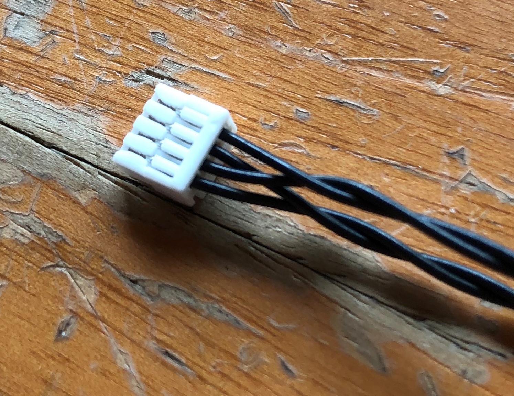

The next step is to build the cable for the connection between Pixracer and Pis. Therefore the JST GHT is needed. Moreover you need a wire, because each Pi needs to be connected to the PixRacer. There need to be 3 wires in the JST GHT. Two of them, those which are in pin 1 and 5, need to be shorted like shown in the picture. 

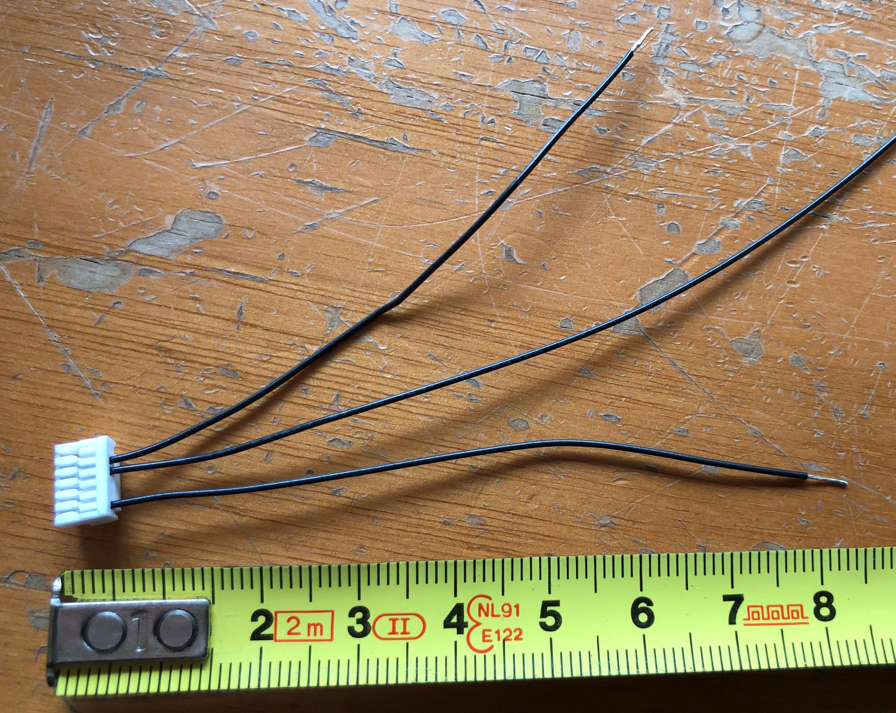

You also need four cables made out of a wire of your choice. The length is shown in the picture below. 

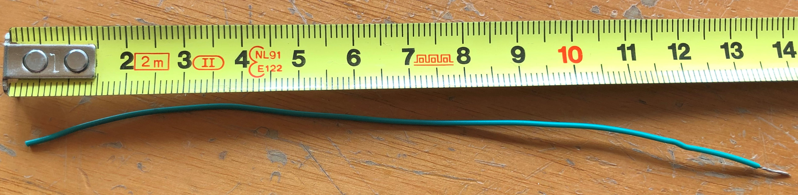

The last step of building the connector cable between the Pi and PixRacer is to solder the previously shortened cables and use a heat shrink tube to isolate them. Don't forget to use two cables \(the green ones in the picture\) for each shortened cable on the connector.

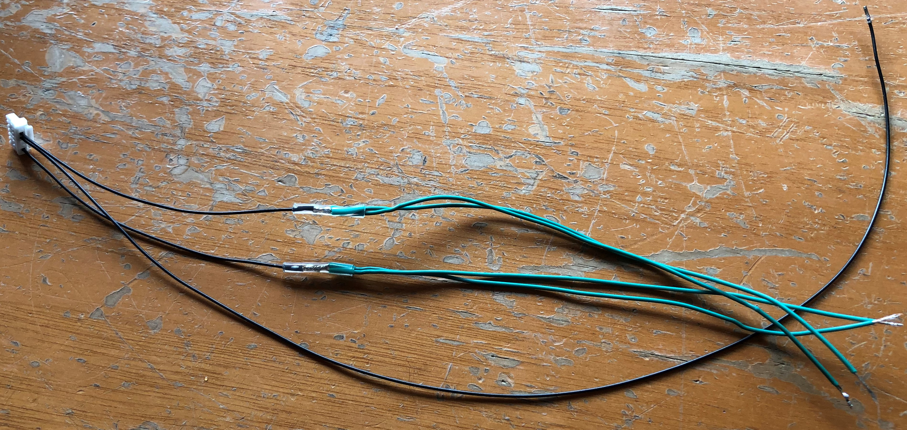

#### Soldering the Cables to the Raspberry Pi Zeros

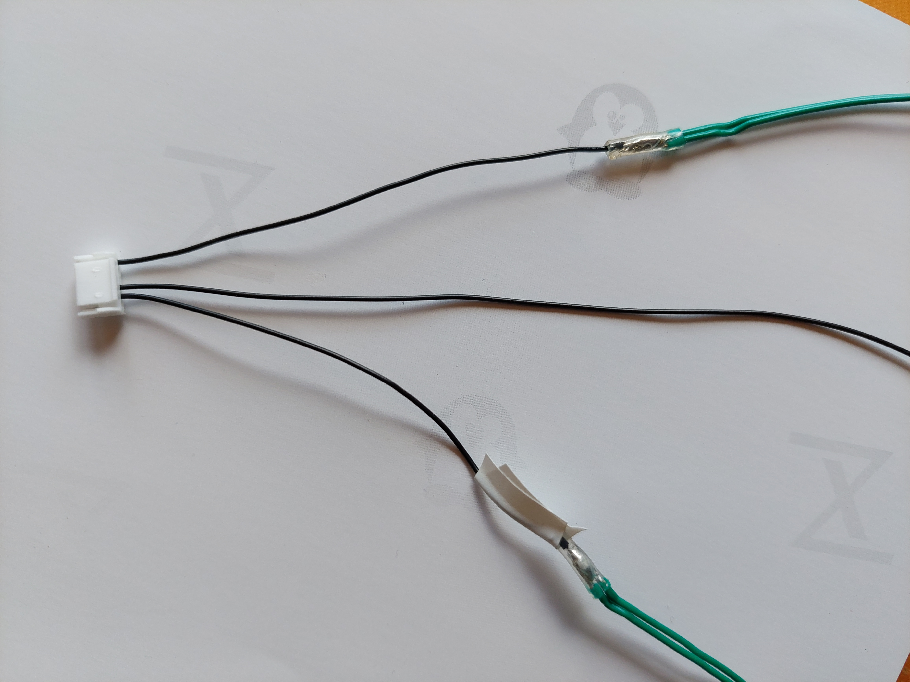

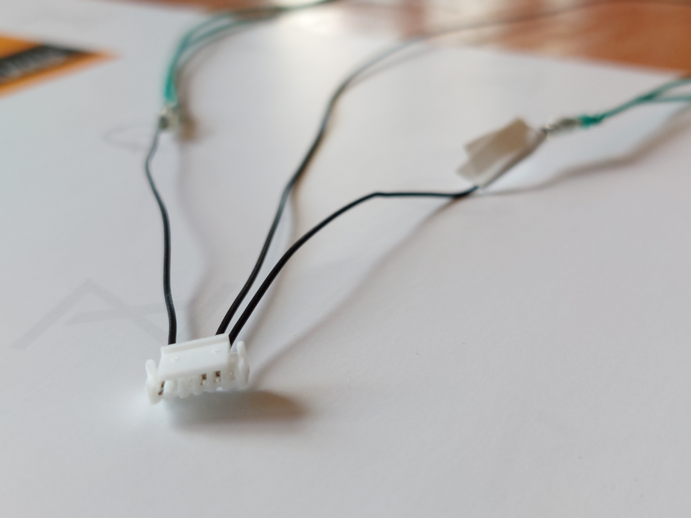

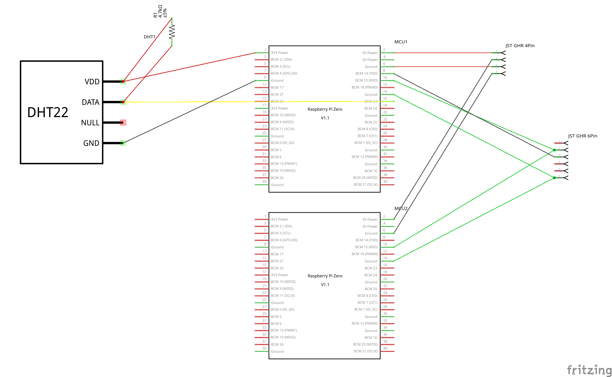

## PixRacer -&gt; RC-Receiver 

The cable connects receiver in the plane \([FrSky R-XSR](../../parts/list-of-parts-and-where-to-buy.md#receiver)\) to 2 ports ob the PixRacer: **RCIN** and **FRS**.

You need:

* From FrSky-Receiver:
  * Plug with 5 cables
  * Remove the white one
* From PixRacer:
  * JST-5 connections \(fitting the RCIN connection\)

    JST-4 connections \(fitting the FRS connection\)

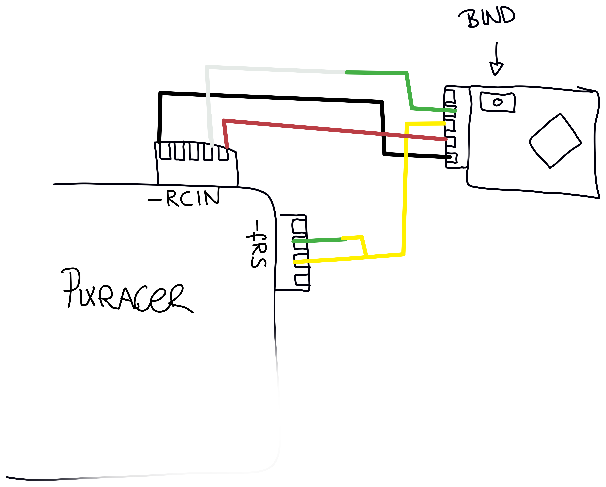

#### How to test

* connect to PixRacer
* connect to receiver
* [bind the remote control to receiver](../software-setup/receiver-software.md#bind-the-receiver-the-the-rc)
* check connection
* check telemetry 
  * Long Press on "PAGE"
  * See the telemetry from the PixRacer

## Telemetrie -&gt; PixRacer

## Finalization & Testing

* [ ] Connect Pixracer, Pis and Power Module 
* [ ] Pi receives messages from pixracer 
* [ ] Pi measures DHT22 humidity
* [ ] * [ ] 
