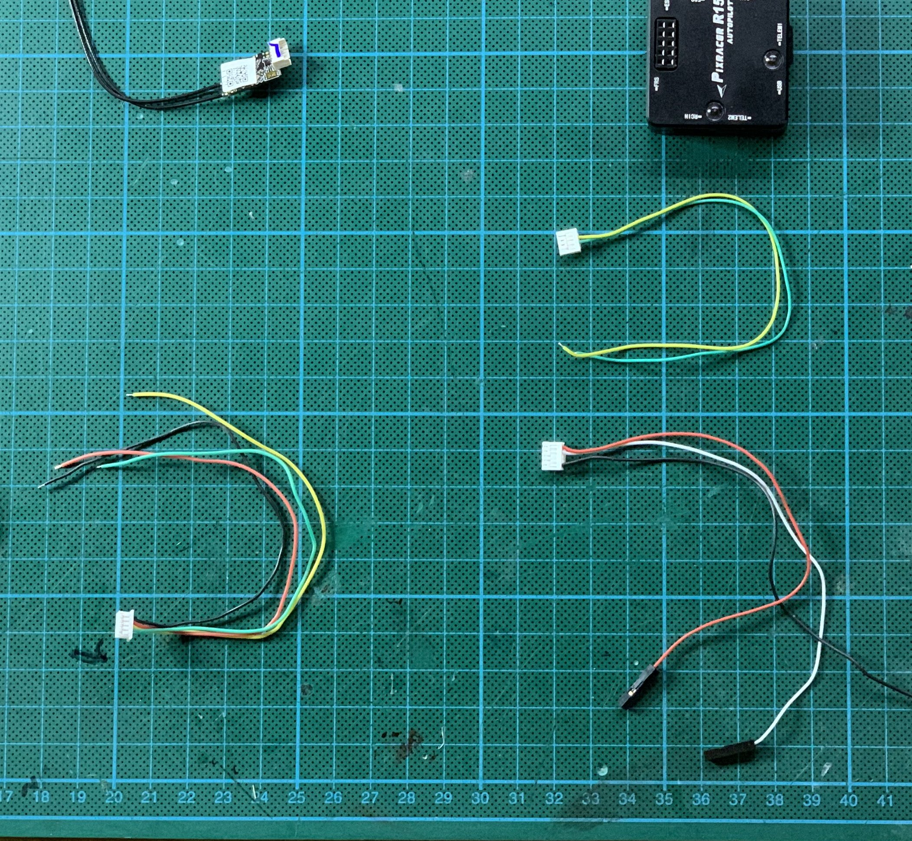

# Producing special cables

#### Time required

* **Building:** 30 minutes

#### Tools required

* 
#### Parts required

* 

## Power-Module -&gt; Raspberry Pi Zero & DHT22

This cable connects the power from the power module to the 2 Raspberry Pi Zeros. This cable also connects the DHT22 sensor \(humidity and temperature\) to one pi.

## Power Switch -&gt; Power Module

## PixRacer -&gt; Raspberry Pi

## PixRacer -&gt; RC-Receiver 

The cable connects receiver in the plane \([FrSky R-XSR](../../parts/list-of-parts-and-where-to-buy.md#receiver)\) to 2 ports ob the PixRacer: **RCIN** and **FRS**.

You need:

* From FrSky-Receiver:
  * Plug with 5 cables
  * Remove the white one
* From PixRacer:
  * JST-5 connections \(fitting the RCIN connection\)

    JST-4 connections \(fitting the FRS connection\)

#### How to test

* connect to PixRacer
* connect to receiver
* bind the remote control to receiver
* check connection
* check telemetry 
  * Long Press on "PAGE"
  * See the telemetry from the PixRacer

## Telemetrie -&gt; PixRacer

## Finalization & Testing

* [ ] Connect Pixracer, Pis and Power Module 
* [ ] Pi receives messages from pixracer 
* [ ] Pi measures DHT22 humidity
* [ ] * [ ] 
