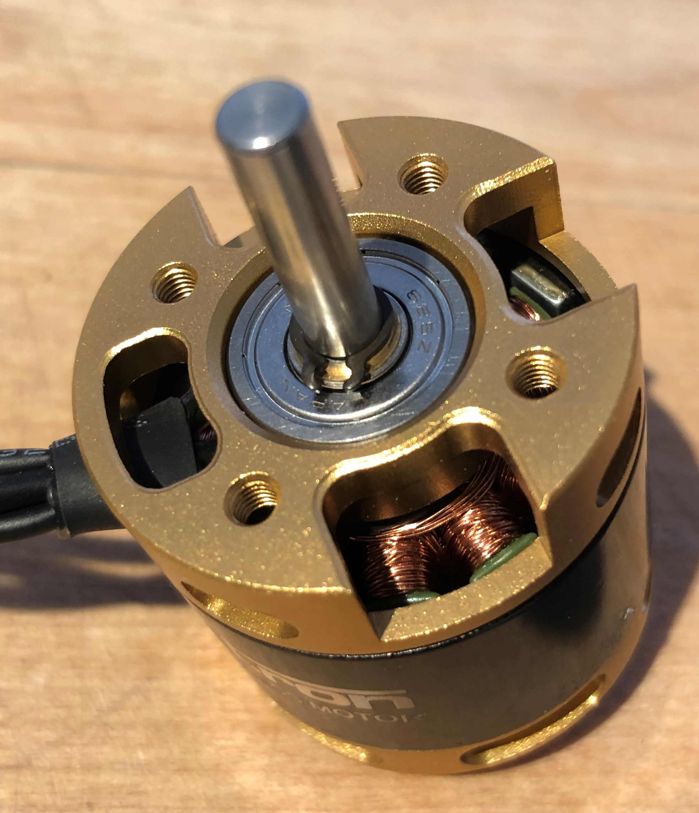
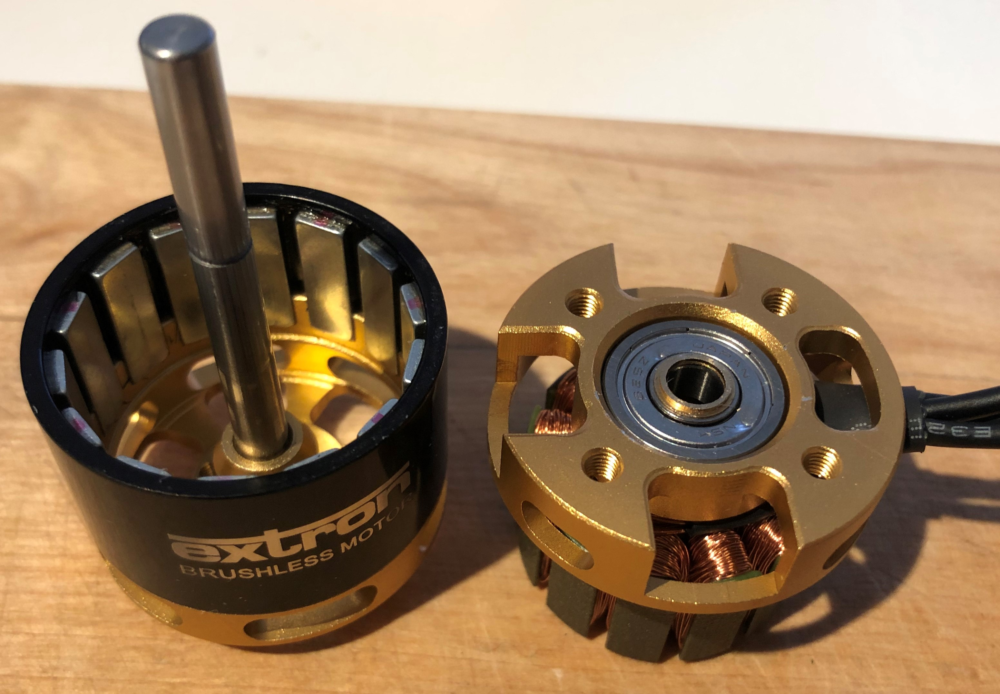
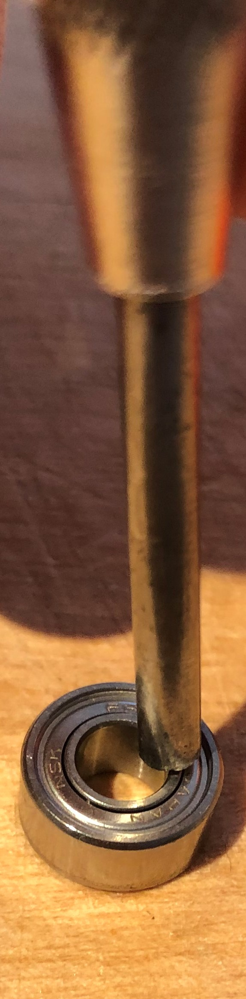
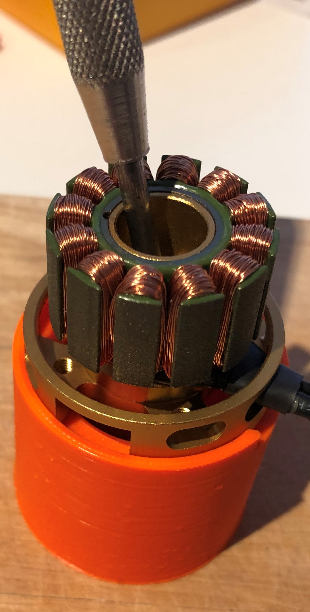
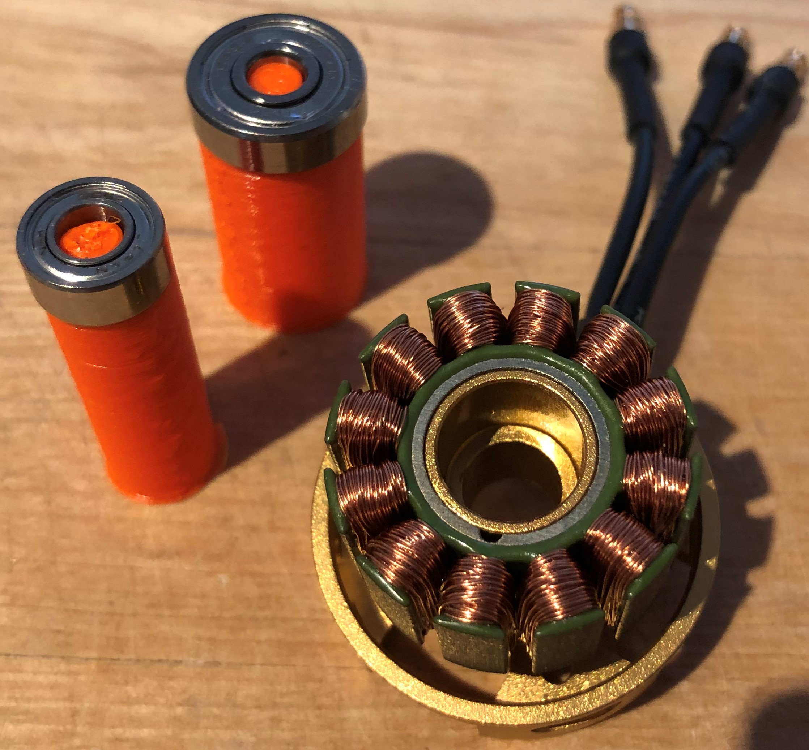
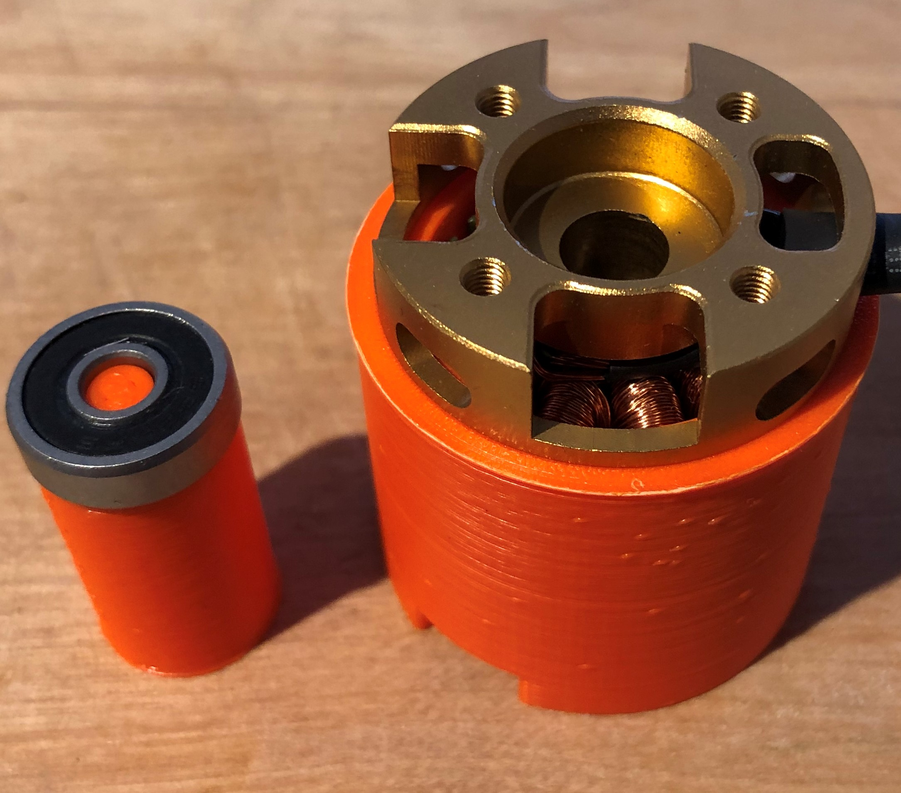
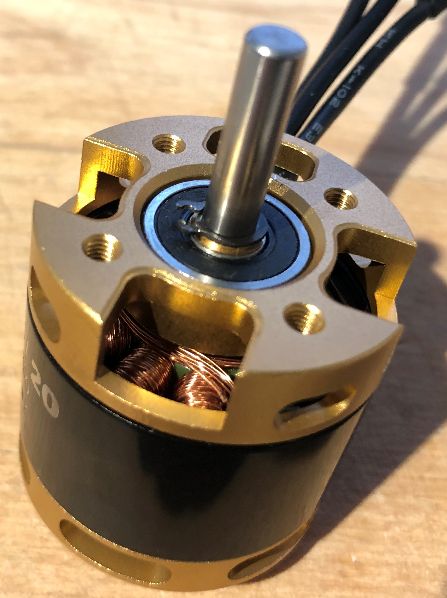

# Waterproofing the motor

#### Time required

* **Building:** 10 minutes

#### Tools required

* 3D-printed mounting aid \(export the STL data from the CAD modell in the link below\) [https://cad.onshape.com/documents/3d72292578f0cf87124dafaf/w/645e27e78913f8a2fc46f6eb/e/d92f338c5cb887f88ac1b3e7](https://cad.onshape.com/documents/3d72292578f0cf87124dafaf/w/645e27e78913f8a2fc46f6eb/e/d92f338c5cb887f88ac1b3e7)
* cotter pin drive 
* hammer 
* small screwdriver

#### Parts required for waterproofing one motor

* 1x Extron Motor
* 2x bearing small 
* 1x bearing big 

## Step 1: disassemble the motor

First of all the circlip shown in the picture below needs to be removed. Therefore a small screwdriver could be helpful. 

After removing the circlip the motor can easily pulled apart. For the next steps you only need to modify the part of the motor, shown in the right side of the next picture. 

There are two little spacer made out of brass on the big bearing on the right side of the picture. You will need the spacer, so don't lose them. 

## Step 2: Removing the bearings

The motor has two small and one bigger bearing which needs to be replaced. You should start with removing the two small bearings first. Therefor place the motor in the mounting aid. You can use your cotter pin driver and position it as shown in the following picture. Use a hammer to cast out the bearing. 

After dismounting the two small bearings turn the motor and the mounting aid around and place it like shown in the next picture. Remove the big bearing by the same method used for the smaller ones. 

## Step 3: Integrating the new bearings 

You are now able to integrate the new bearings. Start with the two small bearings and use the mounting aid, so that the bearings and the motor stays in the right position won't get damaged by the hammer.   
After putting in the two small bearings flip the motor around and install the big bearing with the bigger mounting aid.

## Step 4: assemble the motor

After installing the new bearings you are now able to reassemble the motor. Don't forget to place the two little spacer made out of brass on the shaft before adding the circlip.

## Finalization & Testing

* [ ] check this
* [ ] and that...

