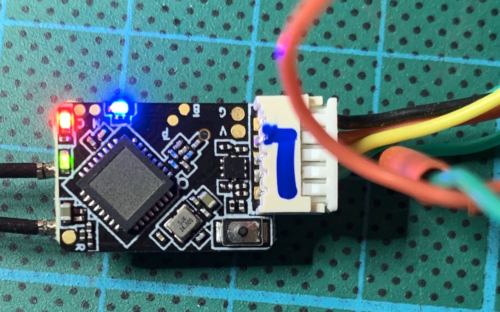
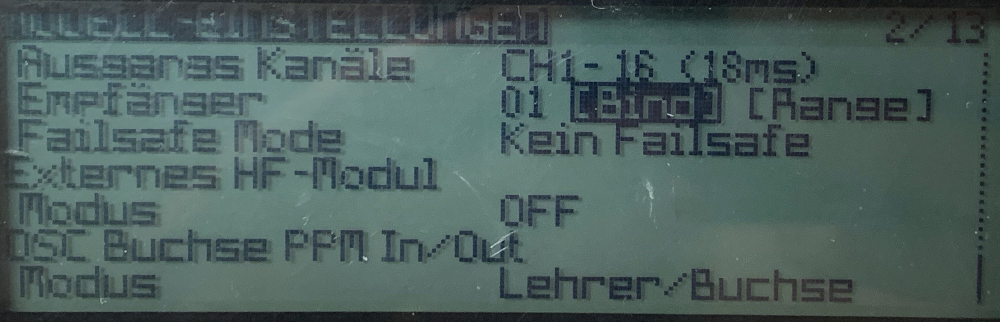
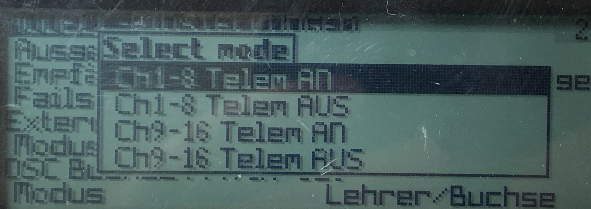
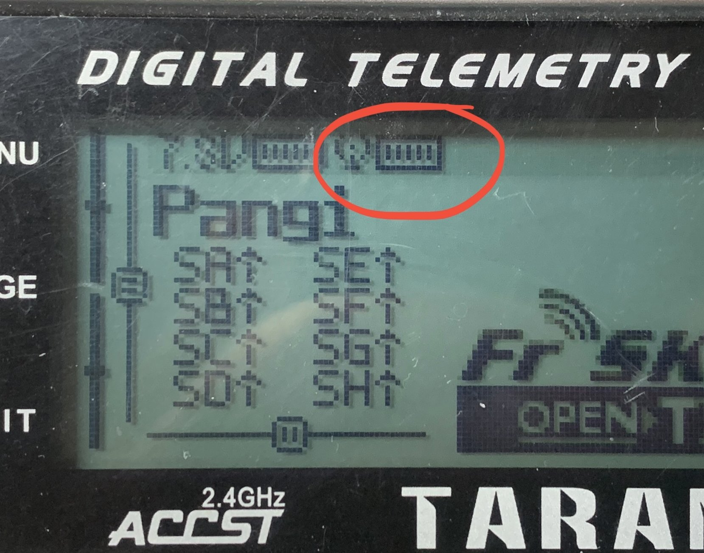
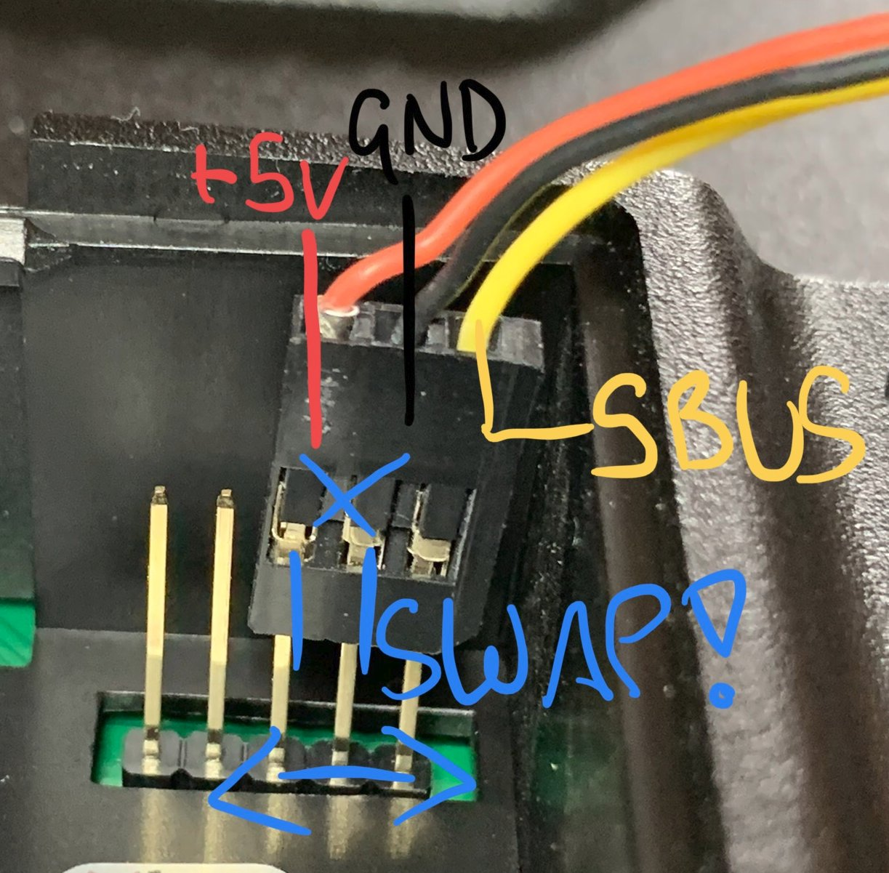
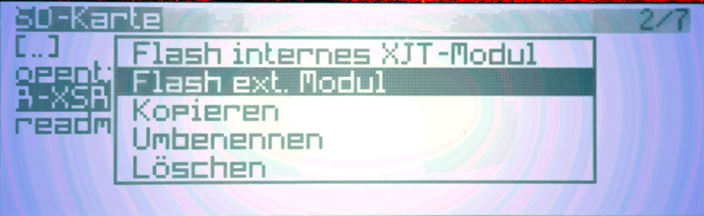
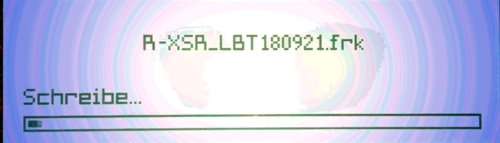

# Receiver Software

## Requirements

* R-XSR + connection cable to Pixracer
* RC

## Bind the receiver to the RC

If it doesn't work, update receiver as below!

### Prepare the receiver

* connect the receiver to the **PixRacer \(not powered\)**
* while **holding the small button** on the receiver, **turn on the PixRacer**
* **All three LEDs are now on \(not flashing\)**

### Prepare the RC

* Turn on the receiver
* **Press** Menu
* **Choose** the desired model
* **Press** page \(page 2 / 13\)
* scroll down to "receiver" / **BIND**
* **Press** Enter

* Press Enter \(cf. Figure above\)
* The receiver will start **peeping**. 
* Immediately the r**ed LED on the receiver should start blinking.**
* **Press Enter to leave binding mode**
* **Turn the PixRacer off and on** - the LED of the receiver should light **blue and green.**
* **Press Exit twice to reach final testing.**

### Final Testing


Looks like this? Your're done!


## If binding doesn't work: Update Firmware on the reciever R-XSR

If the receiver doesn't bind to the remote control, the firmware of the receiver and RC might be not compatible, the used receiver [FrSky R-XSR](../../parts/list-of-parts-and-where-to-buy.md#receiver) might need a firmware update:

To flash the receiver you need:

* Taranis 9D+
* R-XSR

  * included connection cable

 

### Modify the connection cable 

On the included jumper cable, you have to swap the red \(5V\) and black cable \(GND\) as in the picture.

### Upload and flash the firmware

To flash the firmware \(frk file\) you have to upload the file to your RC first. Either connect it via USB cable to your PC - or use the SD Card of the RC:

* Upload the frk file to the "FIRMWARE" folder 
  * you can download the firmware here: [https://www.frsky-rc.com/r-xsr/](https://www.frsky-rc.com/r-xsr/)
  * the current used version \(EU-LBT\) can be found here:
    * [https://github.com/KingBBQ/searchwingDronebuldingDoc/blob/master/Photos/Software/R-XSR\_LBT180921.frk](https://github.com/KingBBQ/searchwingDronebuldingDoc/blob/master/Photos/Software/R-XSR_LBT180921.frk)
* connect the receiver
* turn on the RC
  * **Long Press** MENU
  * **Press** Page
  * choose "**FIRMWARE**"
  * choose the right FRK File
  * **Long Press** Enter
  * choose **"flash external receiver"**
  * **press** Enter

After flashing, try to BIND the receiver again.

