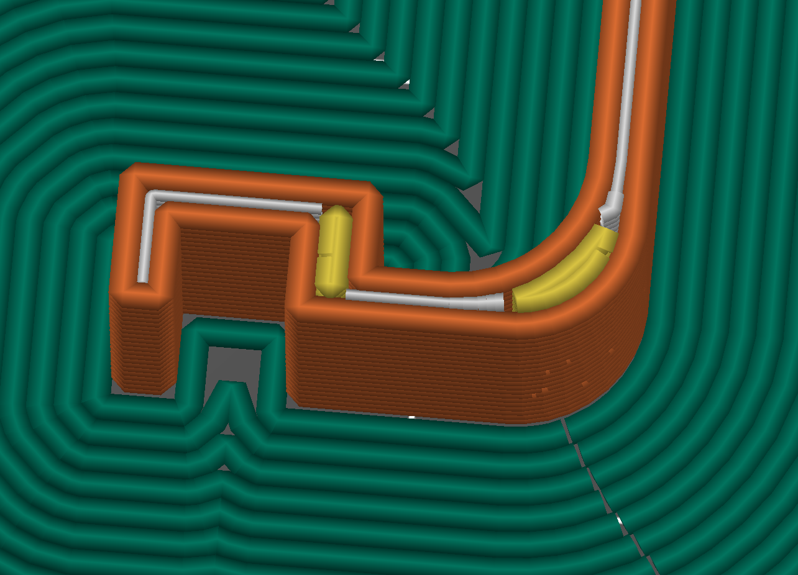
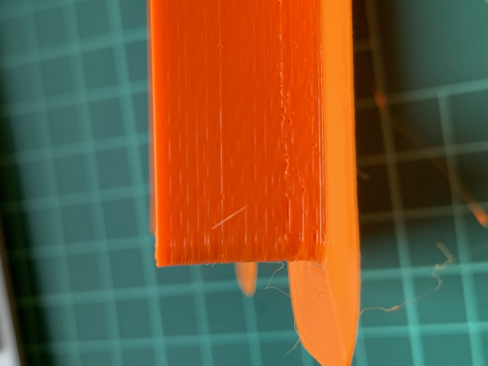
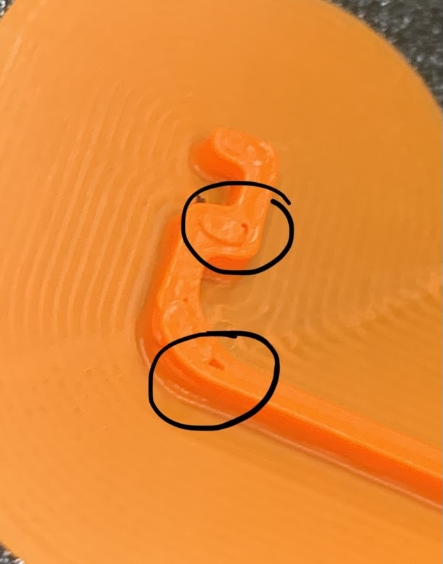
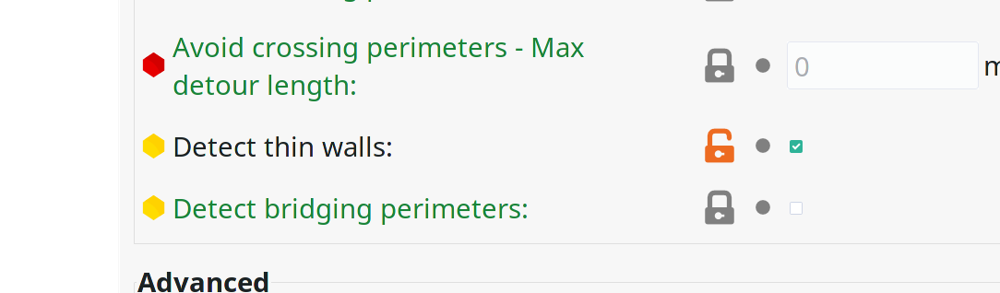
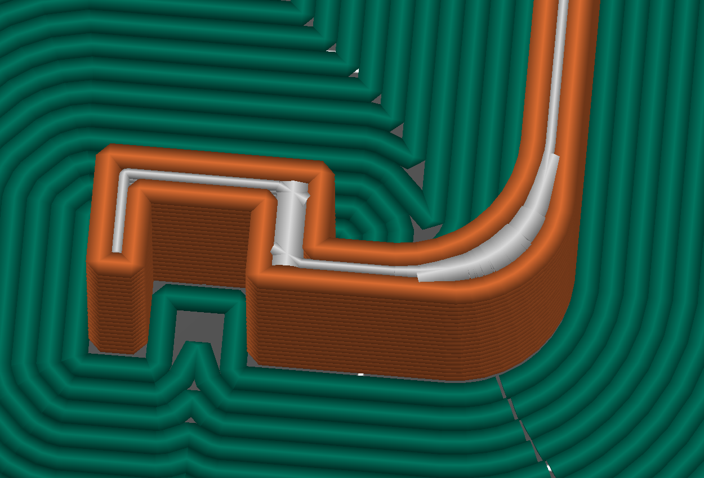
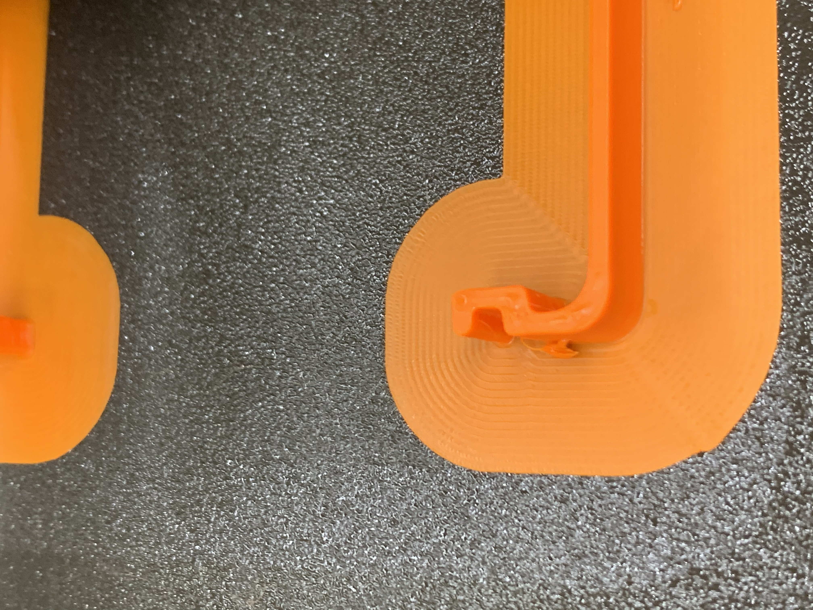
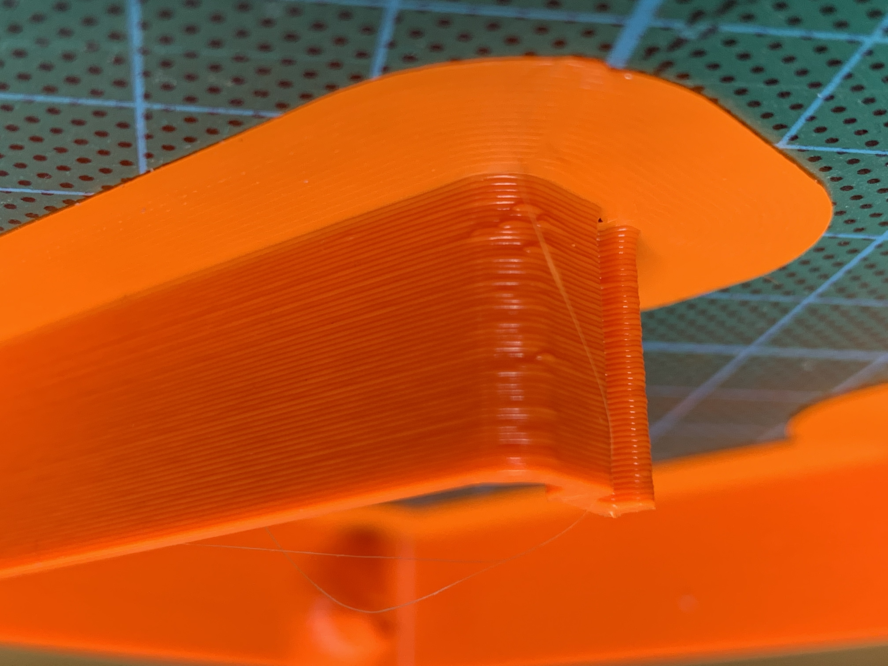
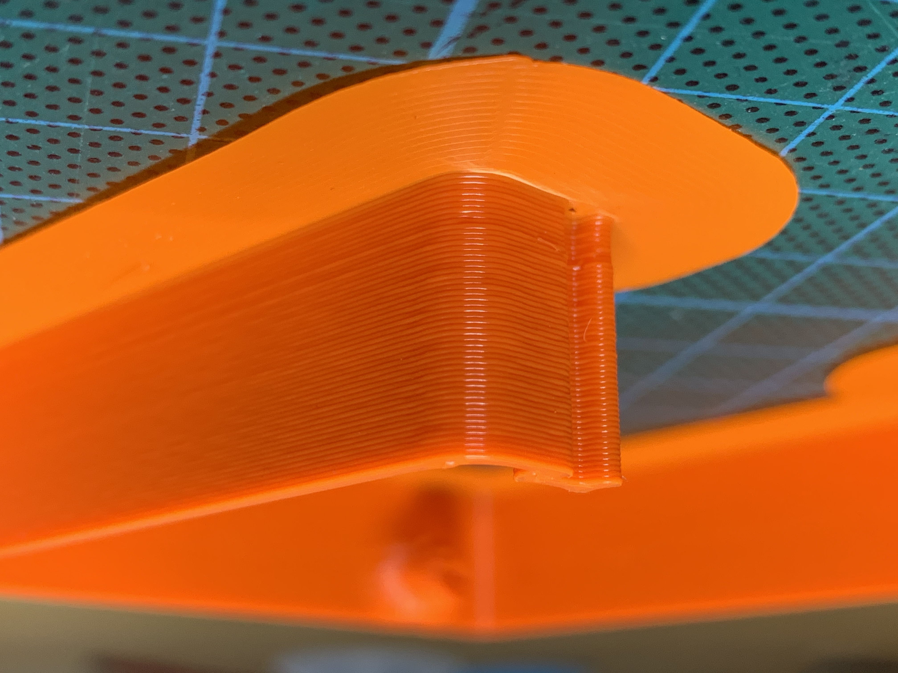

# Detect thin walls setting

We discovered strange tiny holes on the initial prints. We found these holes also in the slicer preview:

## Change the setting 

### Result in the slicer

Also the outer walls are much nicer now:

