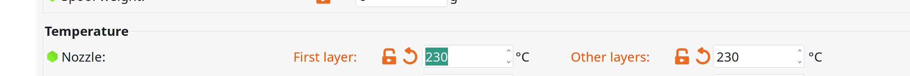
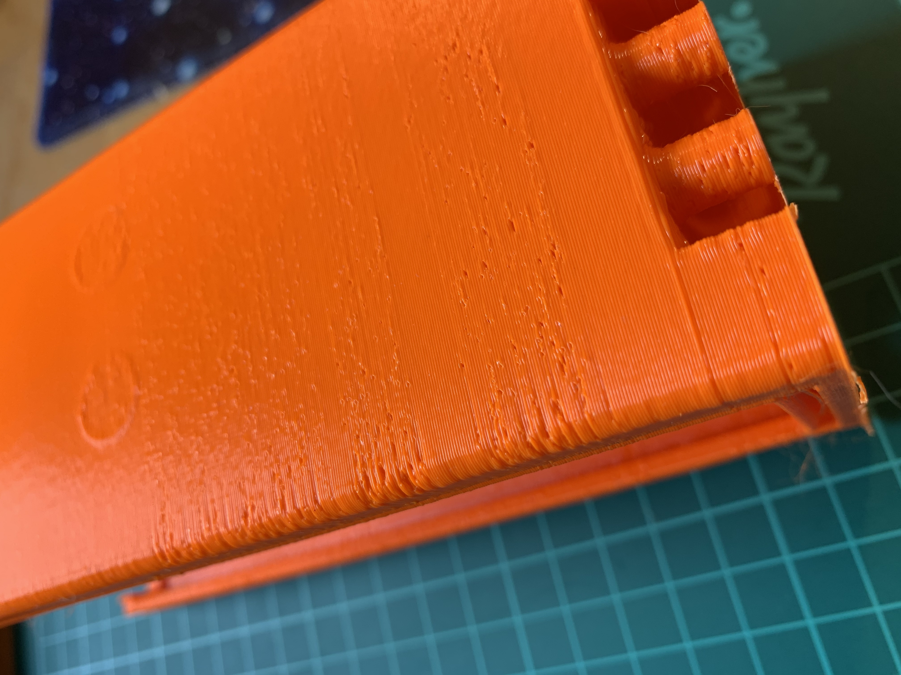

# The right filament

We use ASA for printing the box:

* light
* good layer adhesion
* aceton smoothing

We use Extrudr Dura Pro Asa, which requires lower print temperatures than normal ASA:

If its too hot, the result looks a bit like Swiss cheese:

