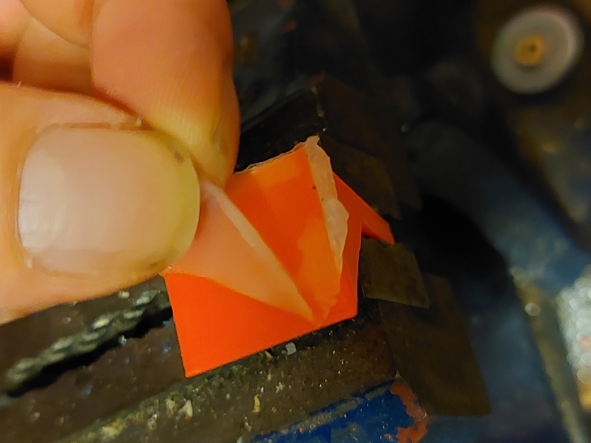

# The right glue for the right parts

## Silicon as a glue

We use silicon to glue the back and front of the box. It acts as a glue - and also as seal. super glue, as we use it for the holders on the side of the box, doesnt work as a seal.

In this test we checked, if silicon has also sufficient adhearence properties.

Test parts can be found in this repository:



The adhesive surface is 4 cm2 each.

the force needed to separate the parts was:

* 13kg for the "double" parts \(4 pieces glued together\)
* 6kg for the "single" parts

The silicon did not bond with the ASA:

