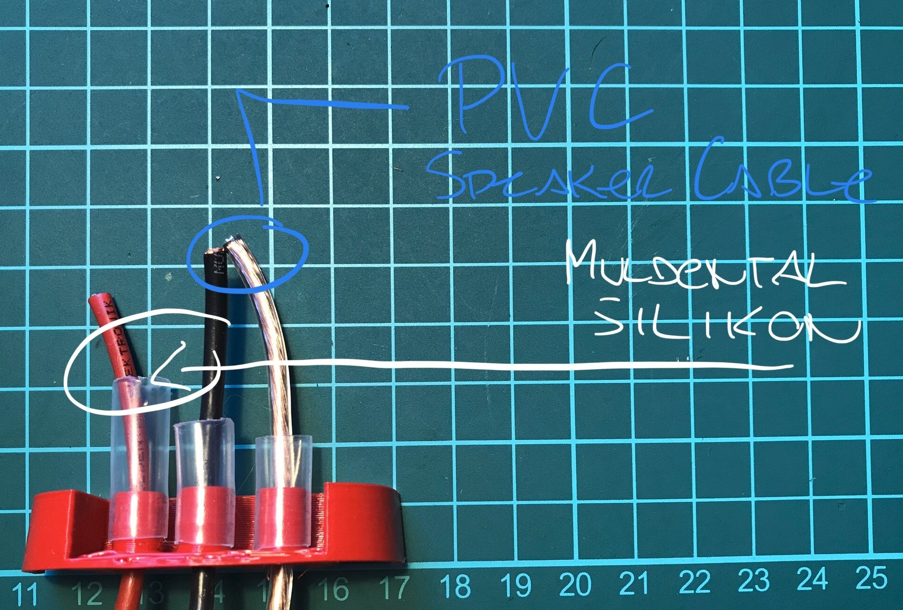
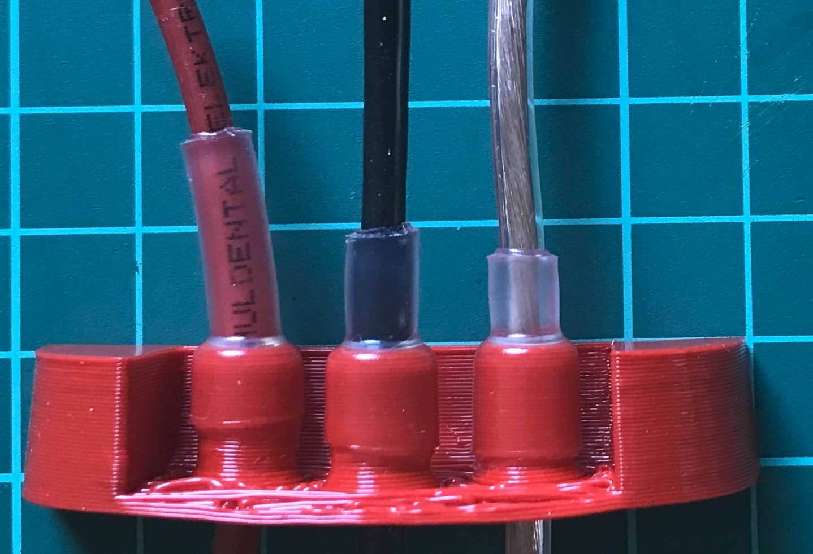
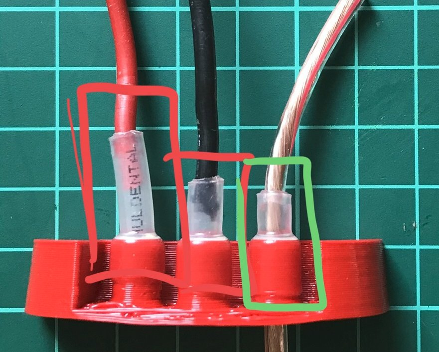

# Watertight cable connections

## Silicon vs. PVC Cables

Shrinking the cables watertight requires a good adhesion between the cable and the shrink tube / hot glue. Tests showed that silikon cables are not as good as normal PVC cables

